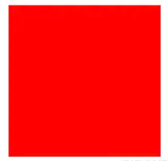

<!-- toc -->

# 什么是BFC

BFC 全称：Block Formatting Context， 名为 "块级格式化上下文"。

W3C官方解释为：BFC它决定了元素如何对其内容进行定位，以及与其它元素的关系和相互作用，当涉及到可视化布局时，Block Formatting Context提供了一个环境，HTML在这个环境中按照一定的规则进行布局。

我们用大白话翻译一下：BFC是一个完全独立的空间，空间里的元素不会影响到外面的布局。

# 创建BFC的方法

* 根元素（<html>）
* 浮动元素（元素的 float 不是 none）
* 绝对定位元素（元素的 position 为 absolute 或 fixed）
* 行内块元素（元素的 display 为 inline-block）
* 表格单元格（元素的 display 为 table-cell，HTML表格单元格默认为该值）
* 表格标题（元素的 display 为 table-caption，HTML表格标题默认为该值）
* 匿名表格单元格元素（元素的 display 为 table、table-row、 table-row-group、table-header-group、table-footer-group（分别是HTML table、row、tbody、thead、tfoot 的默认属性）或 inline-table）
* overflow 计算值(Computed)不为 visible 的块元素
* display 值为 flow-root 的元素
* contain 值为 layout、content 或 paint 的元素
* 弹性元素（display 为 flex 或 inline-flex 元素的直接子元素）
* 网格元素（display 为 grid 或 inline-grid 元素的直接子元素）
* 多列容器（元素的 column-count 或 column-width (en-US) 不为 auto，包括 column-count 为 1）
* column-span 为 all 的元素始终会创建一个新的BFC，即使该元素没有包裹在一个多列容器中（标准变更，Chrome bug）。

# BFC的规则

1. 内部的盒子在垂直方向上一个接一个放置，距离由margin决定（即margin不重叠）
2. 每个元素的左外边距与包含块的左边界相接触（从左向右），即使浮动元素也是如此
3. BFC的区域不会与float的元素区域重叠
4. 计算BFC的高度时，浮动子元素也参与计算

# BFC解决了什么问题

1. margin重叠问题

假如我想要两个盒子之间距离20px，我这么写：
```html
<div class="box2"></div>
<div class="box3"></div>

.box2 {
    margin-bottom: 10px;
    width: 100px;
    height: 100px;
    background-color: red;
}

.box3 {
    margin-top: 10px;
    width: 100px;
    height: 100px;
    background-color: red;
}
```
结果发现，并没有达到预期，两个盒子的margin重叠了，距离只有10px。

怎么解决呢？根据上面的第一条，两个不同BFC环境的盒子，他们两的margin才不会重叠，那么我们只需触发box3的BFC就行

```css
.box3 {
    margin-bottom: 10px;
    width: 100px;
    height: 100px;
    background-color: red;
    float: left;
}
```
这样就实现了两个盒子之间距离20px

2. Float高度塌陷问题

当我们设置浮动的时候，会这么写：
```html
.box {
    margin: 100px;
    width: 100px;
    height: 100px;
    background: red;
    float: left;
}
.container {
    background: #000;
}
<div class="container">
    <div class="box"></div>
    <div class="box"></div>
</div>
```
会发现container的高度为0，没有撑起来。

这时候我们根据上面的第四条，计算BFC的高度时，浮动子元素也参与计算，把外层盒子设置BFC即可：
```css
.container {
    background: #000;
    display: inline-block;
}
```
3. 浮动元素与BFC盒子不重叠

还是看例子：
```html
<div class="box2 w"></div>
<div class="box3 w"></div>

.w {
    width: 100px;
    height: 100px;
}

.box2 {
    float: left; // 触发BFC
    background: red;
}

.box3 {
    background: green;
}

```
结果是，因为红色盒子浮动脱离文档流，导致绿色盒子向前推进，导致红色盒子盖住了绿色盒子:

  

怎么解决呢？根据上面的第三条，BFC的区域不会与float的元素区域重叠，把绿色盒子设置为BFC盒子就行

```css
.box3 {
    background: green;
    overflow:hidden // 触发BFC
}
```

结果：

  
