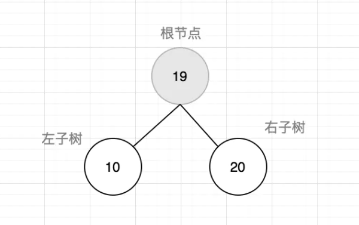
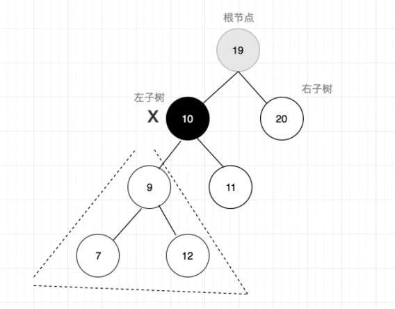

# 树的基本概念

树是用来模拟具有树状结构性质的数据集合。或者你可以把它认为是一种抽象数据结构或是实现这种抽象数据类型的数据结构，用来模拟具有树状结构性质的数据集合。

它是由n（n>0）个有限节点组成一个具有层次关系的集合。把它叫做“树”是因为它看起来像一棵倒挂的树，也就是说它是根朝上，而叶朝下的。它具有以下的特点：

* 每个节点都只有有限个子节点或无子节点；
* 没有父节点的节点称为根节点；
* 每一个非根节点有且只有一个父节点；
* 除了根节点外，每个子节点可以分为多个不相交的子树；
* 树里面没有环路(cycle)


为了更加规范的总结，这里给出的描述来自于维基百科：
> 1.节点的度：一个节点含有的子树的个数称为该节点的度；
> 2. 树的度：一棵树中，最大的节点度称为树的度；
> 3. 叶节点或终端节点：度为零的节点；
> 4. 非终端节点或分支节点：度不为零的节点；
> 5. 父亲节点或父节点：若一个节点含有子节点，则这个节点称为其子节点的父节点；
> 6. 孩子节点或子节点：一个节点含有的子树的根节点称为该节点的子节点；
> 7. 兄弟节点：具有相同父节点的节点互称为兄弟节点；
> 8. 节点的层次：从根开始定义起，根为第1层，根的子节点为第2层，以此类推；
> 9. 深度：对于任意节点n,n的深度为从根到n的唯一路径长，根的深度为0；
> 10. 高度：对于任意节点n,n的高度为从n到一片树叶的最长路径长，所有树叶的高度为0；
> 11. 堂兄弟节点：父节点在同一层的节点互为堂兄弟；
> 12. 节点的祖先：从根到该节点所经分支上的所有节点；
> 13. 子孙：以某节点为根的子树中任一节点都称为该节点的子孙；
> 14. 森林：由m（m>=0）棵互不相交的树的集合称为森林。

# 二叉树的概念

树的种类有很多种，比如B树、霍夫曼树、二叉树等，在这里我们着重了解二叉树。

二叉树是一种典型的树树状结构。如它名字所描述的那样，二叉树是每个节点最多有两个子树的树结构，通常子树被称作“左子树”和“右子树”。


# 二叉搜索（BST）树

二叉搜索树（BST）,它是二叉树的一种，只允许你在左侧节点存储比父节点小的值，在右侧节点存储比父节点大（或者等于）的值。如下图：


接下来我们用代码实现一棵BST树， 在实现之前，我们需要先分析一下BST）树。我们要想构建一棵实用的树，我们需要节点和方法：

* 基类节点
* 基类方法
    + 插入
    + 搜索
    + 遍历
    + 删除

先实现一个基类，如下：

```javascript
function BinarySearchTree() {
    let Node = function (key) {
        this.key = key;
        this.left = null;
        this.right = null;
    }
    let root = null;
}
```

按照上图的二叉搜索树的结构组织方式，来实现二叉树的基本方法。

```javascript
// 插入
this.insert = function (key) {
    let newNode = new Node(key);
    if (root === null) {
        root = newNode;
    } else {
        insertNode(root, newNode);
    }
}
```

其中insertNode方法用来判断在根节点不为空时的执行逻辑，具体代码如下：

```javascript
function insertNode(node, newNode) {
    // 如果新节点值小于当前节点值，则插入左子节点
    if (newNode.key < node.key) {
        if (node.left === null) {
            node.left = newNode;
        } else {
            insertNode(node.left, newNode);
        }
    } else {
        // 如果新节点值大于当前节点值，则插入右子节点
        if (node.right === null) {
            node.right = newNode;
        } else {
            insertNode(node.right, newNode);
        }
    }
}
```

我们需要一个方法查看生成的树:

```javascript
this.getRoot = function () {
    return root;
};
```

**总的代码：**

```javascript
    function BinarySearchTree() {
    let Node = function (key) {
        this.key = key;
        this.left = null;
        this.right = null;
    };
    let root = null;

    this.getRoot = function () {
        return root;
    };

    // 插入
    this.insert = function (key) {
        let newNode = new Node(key);
        if (root === null) {
            root = newNode;
        } else {
            insertNode(root, newNode);
        }
    };

    function insertNode(node, newNode) {
        // 如果新节点值小于当前节点值，则插入左子节点
        if (newNode.key < node.key) {
            if (node.left === null) {
                node.left = newNode;
            } else {
                insertNode(node.left, newNode);
            }
        } else {
            // 如果新节点值大于当前节点值，则插入右子节点
            if (node.right === null) {
                node.right = newNode;
            } else {
                insertNode(node.right, newNode);
            }
        }
    }

}
```

接下来我们使用方法创建一颗树：

```javascript
let tree = new BinarySearchTree()
tree.insert(19)
tree.insert(10)
tree.insert(20)
console.log(tree.getRoot());
```

以上代码生成的二叉树结构如下：



# 树的遍历

树的遍历是指**访问树的每个节点并对它们进行某种操作的过程**。

常见的三种遍历方式：

* 前序遍历
* 中序遍历
* 后序遍历

## 前序遍历

前序遍历是以**优先于后代节点的顺序访问每一个节点**。

比如这样一颗二叉树


前序遍历的顺序是：根节点->左子树->右子树：


遍历结果为：ABDEFGC

具体代码实现如下：
```javascript
this.preOrderTraverse = function(cb) {
    preOrderTraverseNode(root, cb)
}

function preOrderTraverseNode(node, cb) {
    if(node !== null) {
        cb(node.key)
        preOrderTraverseNode(node.left, cb)
        preOrderTraverseNode(node.right, cb)
    }
}
```
## 中序遍历
中序遍历是一种以**从最小到最大**的顺序访问所有节点的遍历方式


中序遍历的顺序是：左子树->根节点->右子树

遍历结果为：DEBGFAC

代码实现如下：
```javascript
this.inOrderTraverse = function(cb) {
    inOrderTraverseNode(root, cb)
}

function inOrderTraverseNode(node, cb) {
    if(node !== null) {
        inOrderTraverseNode(node.left, cb)
        cb(node.key)
        inOrderTraverseNode(node.right, cb)
    }
}
```
## 后序遍历

后序遍历是**先访问节点的后代节点，再访问节点本身**。

遍历顺序为：左子树->右子树->根节点


遍历结果为：EDGFBCA

代码实现如下：
```javascript
this.postOrderTraverse = function(cb) {
    preOrderTraverseNode(root, cb)
}

function postOrderTraverseNode(node, cb) {
    if(node !== null) {
        postOrderTraverseNode(node.left, cb)
        postOrderTraverseNode(node.right, cb)
        cb(node.key)
    }
}
```
# 树的搜索
我们一般的搜索会有最值搜索（也就是最大值，最小值，中值）和对特定值的搜索，接下来我们就来实现它们。

## 搜索特定值

```javascript
this.search = function(key) {
    return searchNode(root, key)
}

function searchNode(ndoe, key) {
    if(node === null) {
        return false
    }
    if(key < node.key) {
        return searchNode(node.left, key)
    }else if(key > node.key) {
        return searchNode(node.right, key)
    }else {
        return true
    }
}
```
## 搜索最小值

由二叉树的结构特征我们可以发现，二叉树的最左端就是最小值，二叉树的最右端就是最大值，所以我们可以通过遍历来找到最小值

```javascript
this.min = function() {
    return minNode(root)
}

function minNode(node) {
    if(node) {
        while(node && node.left !== null) {
            node = node.left;
        }
        return node.key
    }
    return null
}
```
## 搜索最大值

```javascript
this.max = function() {
    return maxNode(root)
}

function maxNode(node) {
    if(node) {
        while(node && node.right !== null) {
            node = node.right;
        }
        return node.key
    }
    return null
}
```
## 移除节点
移除BST中的节点相对来说比较复杂，需要考虑很多情况，具体情况如下：

1. 移除一个叶节点


2. 移除有一个左侧或右侧子节点的节点


3. 移除有两个子节点的节点



考虑到上述几种情况，代码如下：
```javascript
this.remove = function(key) {
    root = removeNode(root, key)
}

function removeNode(node, key) {
    if(node === null) {
        return null
    }
    if(key < node.key) {
        node.left = removeNode(node.left, key)
        return node
    }else if(key > node.key) {
        node.right = removeNode(node.right, key)
        return node
    }else {
        // 一个叶节点
        if(node.left === null && node.right === null) {
            node = null;
            return node
        }
        // 只有一个子节点的节点
        if(node.left === null) {
            node = node.right;
            return node
        }else if(node.right === null) {
            node = node.left;
            return node
        }
        // 有两个子节点的节点情况
        let aux = findMinNode(node.right);
        node.key = aux.key;
        node.right = removeNode(node.right, aux.key);
        return node
    }
}

function findMinNode(node) {
    if(node) {
        while(node && node.left !== null) {
            node = node.left;
        }
        return node
    }
    return null
}
```
