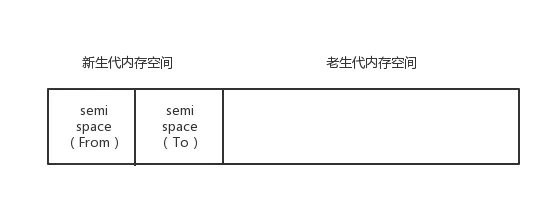
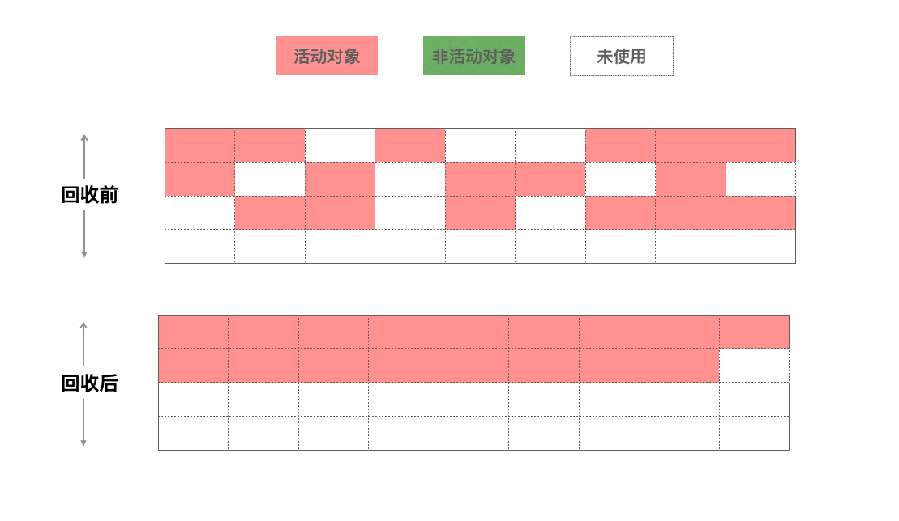

<!-- toc -->

# 垃圾回收机制
垃圾回收又称为 GC(Garbage Collecation)。编写 JavaScript 程序时，开发者不需要手工跟踪内存的使用情况，只要按照标准写 JavaScript 代码，JavaScript 程序运行所需内存的分配以及无用内存的回收完全是自动管理。JavaScript 中自动垃圾回收机制的原理为：
> 找出那些不再使用的变量，然后释放其占用的内存。
> 垃圾收集器会按照固定的时间间隔(或预定的收集时间)周期性地执行此操作。

常用到的垃圾回收方式为：
* 引用计数
* 标记清除

## 一、内存

要想了解JavaScript的垃圾回收机制，必须要知道内存的概念。JavaScript中的内存分为栈内存与堆内存

* 基本类型值在内存中占固定大小的空间，因此被保存在**栈内存**中
* 引用类型值是对象，保存在**堆内存**中。包含引用类型值的变量实际包含并非对象本身，而是指向该对象的指针。一个变量从另一个变量复制引用类型的值时，复制的也是指向该对象的指针。

## 二、引用计数

这是最初级的垃圾收集算法，在IE9之前采用。此算法把“对象是否不再需要”简化定义为“对象有没有其他对象引用到它”。如果没有引用指向该对象（零引用），对象将被垃圾回收机制回收。

```
function test () {
      var a = {} //  a的引用计数为 0,
      var b = a // a 被 b 引用 a引用计数为 1
      let c = a // a 被 c 引用 a引用计数为 2
      b = null // b 不再引用a a的引用计数减为 1
      c = null // c不再引用a a的引用计数减为 0 将被回收
}
```

### 1.引用计数缺陷

该算法有个最大的缺陷：无法处理循环引用。比如：

```
function problem(){
    var a = new Object();
    var b = new Object();
    a.test = b;
    b.test = a;
}
```

上面a,b互相引用,计数不会等于0,内存不会回收,重复调用,会占用大量内存。

## 三、标记-清除算法
此算法可以分为两个阶段，一个是标记阶段（mark），一个是清除阶段(sweep)。

1. **标记阶段**，垃圾回收器会从根对象开始遍历。每一个可以从根对象访问到的对象都会被添加一个标识，于是这个对象就被标识为可到达对象。
2. **清除阶段**，垃圾回收器会对堆内存从头到尾进行线性遍历，如果发现有对象没有被标识为可到达对象，那么就将此对象占用的内存回收，并且将原来标记为可到达对象的标识清除，以便进行下一次垃圾回收操作。

简单来说就是：把所有活动对象做上标记,把没有标记（也就是非活动对象）销毁
  

### 1.标记-清楚算法缺陷

* 那些无法从根对象查询到的对象都将被清除
* 垃圾收集后有可能会造成大量的内存碎片，像上面的图片所示，垃圾收集后内存中存在三个内存碎片，假设一个方格代表1个单位的内存，如果有一个对象需要占用3个内存单位的话，那么就会导致Mutator一直处于暂停状态，而Collector一直在尝试进行垃圾收集，直到Out of Memory。

### 2.常见的内存泄漏

Foo 被调用时, this 指向全局变量(window),相当于与是全局变量,变量不会被回收

```
function test() {
    this.test = "lala";
}
foo();
```

当节点被干掉,定时器还是会不停执行

```
setInterval(function() {
    var node = document.getElementById('div');
    if(node) {
        node.innerHTML = "!......."
    }
}, 5000); 
```

闭包

```
var add = (function () {
    var num = 0;
    return function () {
        return ++num;
    };
  })();
console.log(add());
console.log(add());
console.log(add());
```

## 四、JavaScript V8引擎的垃圾回收机制
在JavaScript脚本中，绝大多数对象的生存期很短，只有部分对象的生存期较长。所以，V8 中的垃圾回收主要使用的是 **分代回收** (Generational collection)机制。

### 1.分代回收机制

V8 引擎将保存对象的 **堆** (heap) 进行了分代:

* 对象最初会被分在 **新生区**(New Space) (1~8M)，新生区的内存分配只需要保有一个指向内存区的指针，不断根据内存大小进行递增，当指针达到新生区的末尾，会有一次垃圾回收清理(小周期)，清理掉新生区中不再活跃的死对象。
* 对于超过 2 个小周期的对象，则需要将其移动至 **老生区**(Old Space)。老生区在 标记-清除 或 标记-紧缩 的过程(大周期) 中进行回收。

大周期进行的并不频繁。一次大周期通常是在移动足够多的对象至老生区后才会发生。

### 2.V8内存限制
在node中javascript能使用的内存是有限制的

> 1. 64位系统下约为1.4GB。
> 2. 32位系统下约为0.7GB。

对应到分代内存中，默认情况下。

> 1. 2位系统新生代内存大小为16MB，老生代内存大小为700MB。 
> 2. 64位系统下，新生代内存大小为32MB，老生代内存大小为1.4GB。

新生代平均分成两块相等的内存空间，叫做semispace，每块内存大小8MB（32位）或16MB（64位）。

### 3.V8为什么会有内存限制

表面上的原因是V8最初是作为浏览器的JavaScript引擎而设计，不太可能遇到大量内存的场景。

而深层次的原因则是由于V8的垃圾回收机制的限制。由于V8需要保证JavaScript应用逻辑与垃圾回收器所看到的不一样，V8在执行垃圾回收时会阻塞JavaScript应用逻辑，直到垃圾回收结束再重新执行JavaScript应用逻辑，这种行为被称为“全停顿”（stop-the-world）。

若V8的堆内存为1.5GB，V8做一次小的垃圾回收需要50ms以上，做一次非增量式的垃圾回收甚至要1秒以上。

这样浏览器将在1s内失去对用户的响应，造成假死现象。如果有动画效果的话，动画的展现也将显著受到影响。

### 4.V8新生代算法（Scavenge）

由于垃圾清理发生的比较频繁，清理的过程必须很快。V8 中的清理过程使用的是 Scavenge 算法，按照 经典的 **Cheney 算法** 实现的。Scavenge 算法的主要过程是：

* 新生区被分为两个等大小的子区(semi-spaces)：to-space 和 from-space；
* 大多数的内存分配都是在 to-space 发生 (某些特定对象是在老生区)；
* 当 to-space 耗尽时，交换 to-space 和 from-space, 此时所有的对象都在 from-space；
* 然后将 from-space 中活跃的对象复制到 to-space 或者老生区中;
* 这些对象被直接压到 to-space，提升了 Cache 的内存局部性，可使内存分配简洁快速。 

  

**Scavenge算法的缺点是只能使用堆内存中的一半，但由于它只复制存活的对象，对于生命周期短的场景存活对象只占少部分，所以在时间效率上有着优异的表现。**

#### 晋升

以上所说的是在纯Scavenge算法中，但是在分代式垃圾回收的前提下，From空间中存活的对象在复制到To空间之前需要进行检查，**在一定条件下，需要将存活周期较长的对象移动到老生代中，这个过程称为对象晋升。**

对象晋升的条件有两个:

1. 一种是对象是否经历过Scacenge回收

2. 另外一种情况是当To空间的使用应超过25%时，则这个对象直接晋升到老生代空间中。
  

### 5.V8老生代算法（Mark-Sweep，Mark-Compact）

在老生代中的对象，由于存活对象占比较大，再采用Scavenge方式会有两个问题：

* 一个是存活对象就较多，复制存活对象的效率将会降低；
* scavenge是牺牲空间来换取时间效率的算法，而老生代支持的容量较大，会出现空间资源浪费问题

为此，V8在老生代中主要采用Mark-Sweep和Mark-Compact相结合的方式进行垃圾回收。

#### Mark-Sweep(标记- 清除算法)

这个算法上文有提到过，这里再说一下。

* 标记阶段：对老生代进行第一次扫描，标记活动对象
* 清理阶段：对老生代进行第二次扫描，清除未被标记的对象，即清理非活动对象

还遗留一个问题，被清除的对象遍布于各内存地址，产生很多内存碎片。所以在此基础上提出**Mark-Compact**算法。
#### Mark-Compact(标记-整理算法)

由于Mark-Sweep完成之后，老生代的内存中产生了很多内存碎片，若不清理这些内存碎片，如果出现需要分配一个大对象的时候，这时所有的碎片空间都完全无法完成分配，就会提前触发垃圾回收，而这次回收其实不是必要的。

为了解决内存碎片问题，Mark-Compact被提出，它是在 Mark-Sweep的基础上演进而来的，相比Mark-Sweep，Mark-Compact添加了活动对象整理阶段，将所有的活动对象往一端移动，移动完成后，直接清理掉边界外的内存。



