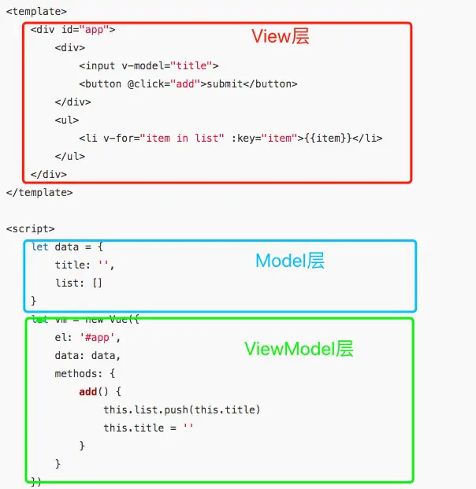

<!-- toc -->

# 什么是MVVM？

MVVM拆开来即为Model-View-ViewModel，有View，ViewModel，Model三部分组成。View层代表的是视图、模版，负责将数据模型转化为UI展现出来。Model层代表的是模型、数据，可以在Model层中定义数据修改和操作的业务逻辑。ViewModel层连接Model和View。

在MVVM的架构下，View层和Model层并没有直接联系，而是通过ViewModel层进行交互。ViewModel层通过双向数据绑定将View层和Model层连接了起来，使得View层和Model层的同步工作完全是自动的。因此开发者只需关注业务逻辑，无需手动操作DOM，复杂的数据状态维护交给MVVM统一来管理。在Vue.js中MVVM的体现：

# Cookie、sessionStorage、localStorage

相同点：

* 存储在客户端

不同点：

* cookie数据大小不能超过4k；sessionStorage和localStorage的存储比cookie大得多，可以达到5M+
* cookie设置的过期时间之前一直有效；localStorage永久存储，浏览器关闭后数据不丢失除非主动删除数据；sessionStorage数据在当前浏览器窗口关闭后自动删除
* cookie的数据会自动的传递到服务器；sessionStorage和localStorage数据保存在本地

# 从输入URL到页面加载的全过程

1. 在浏览器中输入URL
2. 查找缓存，浏览器先查看浏览器缓存-系统缓存-路由缓存中是否有该地址页面，如果有则显示页面内容。如果没有则进行下一步。
3. DNS域名解析：浏览器向DNS服务器发起请求，解析该URL中的域名对应的IP地址。
4. 建立TCP连接：解析出IP地址后，根据IP地址和默认80端口，和服务器建立TCP连接
5. 发起HTTP请求：浏览器发起读取文件的HTTP请求，，该请求报文作为TCP三次握手的第三次数据发送给服务器
6. 服务器响应请求并返回结果：服务器对浏览器请求做出响应，并把对应的html文件发送给浏览器
7. 关闭TCP连接：通过四次挥手释放TCP连接
8. 浏览器渲染：客户端（浏览器）解析HTML内容并渲染出来
    * 构建DOM树：词法分析然后解析成DOM树（dom tree），是由dom元素及属性节点组成，树的根是document对象
    * 构建CSS规则树：生成CSS规则树（CSS Rule Tree）
    * 构建render树：Web浏览器将DOM和CSSOM结合，并构建出渲染树（render tree）
    * 布局（Layout）：计算出每个节点在屏幕中的位置
    * 绘制（Painting）：即遍历render树，并使用UI后端层绘制每个节点。
9. JS引擎解析过程：调用JS引擎执行JS代码。

# 数据检测方式

### typeof

* 优点：能够快速区分基本数据类型
* 缺点：不能将Object、Array和Null区分，都返回object

### instanceof

* 优点：能够区分Array、Object和Function，适合用于判断自定义的类实例对象
* 缺点：Number，Boolean，String基本数据类型不能判断

### Object.prototype.toString.call()

* 优点：精准判断数据类型
* 缺点：写法繁琐不容易记，推荐进行封装后使用

# computed与watch区别

* computed：计算属性，计算的结果会被缓存，当依赖改变时才会改变。
* watch：监听属性，监听某个属性的变换，执行一些操作

使用场景：

* computed：当一个属性受多个属性影响的时候使用，例：购物车商品结算功能 
* watch：当一条数据影响多条数据的时候使用，例：搜索数据

# data为什么是一个函数

1. 一个组件被复用多次的话，也就会创建多个实例。本质上，这些实例用的都是同一个构造函数。
2. 如果data是对象的话，对象属于引用类型，会影响到所有的实例。所以为了保证组件不同的实例之间data不冲突，data必须是一个函数。

# v-for和v-if不建议用在一起

-for 的优先级比 v-if 更高，如果要遍历的数组很大，而真正要展示的数据很少时，这将造成很大的性能浪费。

注意：3.x 版本中 v-if 总是优先于 v-for 生效。

# key 的作用

1. 为了在diff算法执行时更快的找到对应的节点，提高diff速度，更高效的更新虚拟DOM;

在vue的diff函数中，会根据新节点的key去对比旧节点数组中的key，从而找到相应旧节点。如果没找到就认为是一个新增节点。而如果没有key，那么就会采用遍历查找的方式去找到对应的旧节点。一种一个map映射，另一种是遍历查找。相比而言。map映射的速度更快。

2. 为了在数据变化时强制更新组件，以避免“就地复用”带来的副作用。

当 Vue.js 用 v-for 更新已渲染过的元素列表时，它默认用“就地复用”策略。如果数据项的顺序被改变，Vue 将不会移动 DOM 元素来匹配数据项的顺序，而是简单复用此处每个元素，并且确保它在特定索引下显示已被渲染过的每个元素。重复的key会造成渲染错误。

