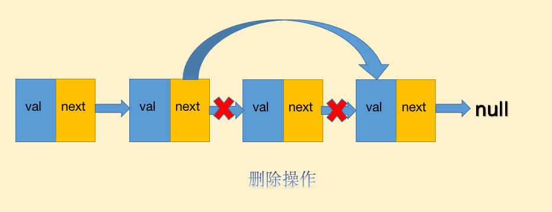

# 什么是链表

前面我们讨论了如何使用栈、队列进行存数数据，他们其实都是列表的一种，底层存储的数据的数据结构都是数组。

数组的特点是**查询数据快，插入数据慢**，查询的时间复杂度是O(1),插入的时间复杂度是O(n).

链表我们平时用的比较少，它的特点是:**插入数据快，查询数据慢**，查询的时间复杂度是：O(n)，插入的时间复杂度是：O(1)，它的特点是和数组相反的。

链表是一种线性表，但是并不会按线性的顺序存储数据，而是在每一个节点里存到下一个节点的指针(Pointer).

当然,链表也有不同的形态,主要分为三种:单向链表、双向链表、循环链表.

# 单向链表

单向链表的节点通常由两个部分构成,一个是节点储存的值val,另一个就是节点的指针next.

链表与数组类似,也可以进行查找、插入、删除、读取等操作,但是由于链表与数组的特性不同,导致不同操作的复杂度也不同.

## 查找性能

单向链表的查找操作通常是这样的:
* 从头节点进入,开始比对节点的值,如果不同则通过指针进入下一个节点
* 重复上面的动作,直到找到相同的值,或者节点的指针指向null

链表的查找性能与数组一样,都是时间复杂度为O(n).

## 插入删除性能

链表与数组最大的不同就在于删除、插入的性能优势,由于链表是非连续的内存,所以不用像数组一样在插入、删除操作的时候需要进行大面积的成员位移,比如在a、b节点之间插入一个新节点c,链表只需要:

1. a断开指向b的指针，将指针指向c
2. c节点将指针指向b，完毕

这个插入操作仅仅需要移动一下指针即可，插入、删除的时间复杂度只有O(1).

## 读取性能

链表的读取操作远不如数组，链表由于非连续内存，所以必须通过指针一个一个节点遍历。需要从头部节点进入,在通过指针进入后续节点才能读取。这是链表对于数组的劣势。

# 双向链表

单向链表的应用场景并不多,而真正在生产环境中被广泛运用的正是双向链表。

双向链表多了一个新的指针prev指向节点的前一个节点,当然由于多了一个指针,所以双向链表要更占内存.

