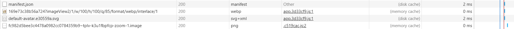

<!-- TOC -->
# 一. 为什么缓存
缓存是一种性能优化，可以缩短网络请求的时间，提高文件的重复利用率。
# 二. 缓存的位置
## 1. Memory Cache
将资源缓存到内存中，等待下次访问时不需要重新下载资源，而是直接从内存获取。

特点：读取高效，但是容量小，缓存持续性短，一旦关闭页面，内存重得缓存就会被释放。

## 2. Disk Cache
将资源存在磁盘中。

特点：可以容量大，但读取速度慢，最大的有点时存储的时效性（长时间不过期）。

相比于内存缓存，硬盘缓存会根据HTTP头部中的字段判断哪些资源需要缓存哪些可以直接使用那些需要重新请求。如果相同URL的资源一旦被硬盘缓存，就不会再去请求数据。（HTTP头部缓存信息在下一部分）

## 3. Push Cache
只在Session中存在，一旦会话结束就被释放

特点：缓存时间很短暂（chrome 5min），同时也不会严格执行HTTP头中的缓存指令

**优先级： Memory Cache >  Disk Cache > Push Cache**

示例：

# 三. 缓存过程

上面所说的 **缓存规则**，就是声明所请求的这个资源，要采取哪种缓存策略？缓存多长时间？等等。。。而这个规则，是在http的header中的返回来的。

根据是否需要向服务器重新发起HTTP请求，缓存的过程可以分为强缓存和协议缓存

# 四. 强缓存

简单粗暴，如果资源没过期，就取缓存，如果过期了，则请求服务器。

如何判断资源是否过期呢，主要是看 response headers 中的 Cache-Control 的值。

而和 Cache-Control 并列的，还有一个 Expires ，已经基本淘汰了。

**Cache-Control 的几个取值含义：**

* private： 仅浏览器可以缓存
* public： 浏览器和代理服务器都可以缓存（对于private和public，前端可以认为一样，不用深究）
* max-age=xxx：过期时间（常用）
* no-cache：不进行强缓存（常用）
* no-store：不强缓存，也不协商缓存 

**Expires**
* Expires = max-age + 请求时间（Date）,需要和Last-Modified结合使用

**规则可以同时多个**

强缓存流程：

# 五. 协商缓存
触发条件：
1. Cache-Control 的值为 no-cache （不强缓存）
2. 或者 max-age 过期了 （强缓存，但总有过期的时候）

## 协商缓存的规则:
1. ETag：每个文件有一个，是一个字符串，其内容通常是数据的哈希值,改动文件了就变了，可以看似md5                      

> 浏览器在下一次请求资源时，会把上一次返回的Etag放在request Header的If-None-Match中，服务器比较If-None-Match与自己服务器中的Etag就知道要不要重新返回资源了。

2. Last-Modified：文件的修改时间,服务器可以通过配置这个响应头，来向浏览器发送一个数据上次被修改的时间标签，例如：Last-Modified:Wed, 24 Apr 2019 02:54:16 GMT
 
> 浏览器下一次请求这个资源的时候，浏览器检测到有Last-Modified这个Header,将Last-Modified中的时间添加到If-Modified-Since这个Header中发出

> 此时服务器接收到这个资源请求，会拿If-Modified-Since中的时间与服务器中这个资源的最后修改时间对比，没变化就返回304，最后修改时间比If-Modified-Since中的时间大，就说明有变化，返回200和新的资源文件

## 协商缓存步骤

**总结**
1. 请求资源时，把用户本地该资源的 ETag 同时带到服务端，服务端和最新资源做对比。
2. 如果资源没更改，返回304，浏览器读取本地缓存。
3. 如果资源有更改，返回200，返回最新的资源。

# 六. 缓存命中状态码

|     | Status  |Size |
|  ----  | ----  |----  |
| 从服务器获取新的资源  | 200 | 真实大小|
| 强缓存  | 200 | dist cache/memory cache |
| 协商缓存  | 304 | xxxB|

