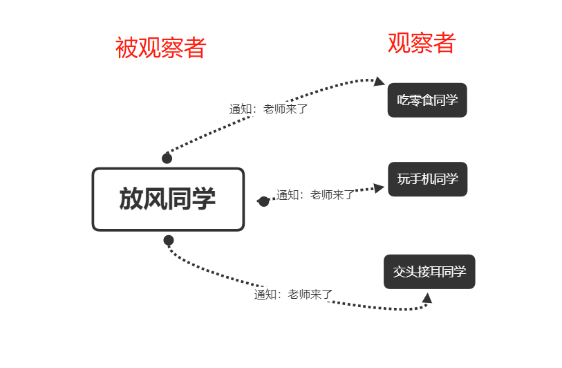

# 发布-订阅模式

发布—订阅模式它定义对象间的一种一对多的依赖关系，当一个对象的状态发生改变时，所有依赖于它的对象都将得到通知。在 JavaScript 开发中，我们一般用事件模型来替代传统的发布—订阅模式。

## 现实中的发布－订阅模式

不论是在程序世界里还是现实生活中，发布—订阅模式的应用都非常之广泛。我们先看一个 现实中的例子。

小明最近看上了一套房子，到了售楼处之后才被告知，该楼盘的房子早已售罄。好在售楼 MM 告诉小明，不久后还有一些尾盘推出，开发商正在办理相关手续，手续办好后便可以购买。 但到底是什么时候，目前还没有人能够知道。

小明离开之前，把电话号码留在了售楼处。售楼 MM 答应他，新楼盘一推出就马上发信息通知小明。小红、小强和小龙也是一 样，他们的电话号码都被记在售楼处的花名册上，新楼盘推出的时候，售楼 MM 会翻开花名册，
遍历上面的电话号码，依次发送一条短信来通知他们。

在刚刚的例子中，发送短信通知就是一个典型的发布—订阅模式，小明、小红等购买者都是 订阅者，他们订阅了房子开售的消息。售楼处作为发布者，会在合适的时候遍历花名册上的电话 号码，依次给购房者发布消息。

## 代码实现

我们用代码来实现上面的案例

```javascript
var salesOffices = {}; // 定义售楼处
salesOffices.clientList = []; // 缓存列表，存放订阅者的回调函数
salesOffices.listen = function( fn ){ // 增加订阅者
 this.clientList.push( fn ); // 订阅的消息添加进缓存列表
}; 
salesOffices.trigger = function(){ // 发布消息
 for( var i = 0, fn; fn = this.clientList[ i++ ]; ){ 
 fn.apply( this, arguments ); // (2) // arguments 是发布消息时带上的参数
 } 
};
```

> arguments 是一个对应于传递给函数的参数的类数组对象 [文档](https://developer.mozilla.org/zh-CN/docs/Web/JavaScript/Reference/Functions/arguments)

至此，我们已经实现了一个最简单的发布—订阅模式。

下面我们来进行一些简单的测试：

```javascript
salesOffices.listen(function(price, squareMeter) { // 小明订阅消息
    console.log('价格= ' + price);
    console.log('squareMeter= ' + squareMeter);
});
salesOffices.listen(function(price, squareMeter) { // 小红订阅消息
    console.log('价格= ' + price);
    console.log('squareMeter= ' + squareMeter);
});
salesOffices.trigger(2000000, 88); // 输出：200 万，88 平方米
salesOffices.trigger(3000000, 110); // 输出：300 万，110 平方米
```

但这里还存在一些问题，比如：

1. 我们看到订阅者接收到了发布者发布的每个消息，虽然小明只想买 88 平方米的房子，但是发布者把 110 平 方米的信息也推送给了小明，这对小明来说是不必要的困扰。
2. 有时候，我们也许需要取消订阅事件的功能，比如小明突然不想买房子了，为了避免继续接 收到售楼处推送过来的短信，小明需要取消之前订阅的事件。

针对以上问题，我们可以这么解决

1. 增加一个标示 key，让订阅者只订阅自己感兴趣的消息。
2. 增加取消订阅的事件

直接来看代码：

```javascript
var salesOffices = {}; // 定义售楼处
salesOffices.clientList = {}; // 缓存列表，存放订阅者的回调函数
salesOffices.listen = function(key, fn) {
    if (!this.clientList[key]) { // 如果还没有订阅过此类消息，给该类消息创建一个缓存列表
        this.clientList[key] = [];
    }
    this.clientList[key].push(fn); // 订阅的消息添加进消息缓存列表
};
salesOffices.remove = function(key, fn) {
    var fns = this.clientList[key];
    if (!fns) { // 如果 key 对应的消息没有被人订阅，则直接返回
        return false;
    }
    if (!fn) { // 如果没有传入具体的回调函数，表示需要取消 key 对应消息的所有订阅
        fns && (fns.length = 0);
    } else {
        for (var l = fns.length - 1; l >= 0; l--) { // 反向遍历订阅的回调函数列表
            var _fn = fns[l];
            if (_fn === fn) {
                fns.splice(l, 1); // 删除订阅者的回调函数
            }
        }
    }
};
salesOffices.trigger = function() { // 发布消息
    var key = Array.prototype.shift.call(arguments),
    // 取出消息类型
    fns = this.clientList[key]; // 取出该消息对应的回调函数集合
    if (!fns || fns.length === 0) { // 如果没有订阅该消息，则返回
        return false;
    }
    for (var i = 0, fn; fn = fns[i++];) {
        fn.apply(this, arguments); // (2) // arguments 是发布消息时附送的参数
    }
};

salesOffices.listen('squareMeter88',function(price) { // 小明订阅 88 平方米房子的消息
    console.log('价格= ' + price); // 输出： 2000000 
});
salesOffices.listen('squareMeter110',function(price) { // 小红订阅 110 平方米房子的消息
    console.log('价格= ' + price); // 输出： 3000000 
});
salesOffices.trigger('squareMeter88', 2000000); // 发布 88 平方米房子的价格
salesOffices.trigger('squareMeter110', 3000000); // 发布 110 平方米房子的价格
salesOffices.remove('squareMeter88', fn1); // 删除小明的订阅
salesOffices.trigger('squareMeter88', 2000000); // 发布 88 平方米房子的价格，小明不会收到价格提醒
```

## 继续优化

现在我们已经看到了如何让售楼处拥有接受订阅和发布事件的功能。假设现在小明又去另一个售楼处买房子，那么这段代码是否必须在另一个售楼处对象上重写一次呢，有没有办法可以让 所有对象都拥有发布—订阅功能呢？ 答案显然是有的，JavaScript
作为一门解释执行的语言，给对象动态添加职责是理所当然的 事情。 所以我们把发布—订阅的功能提取出来，放在一个单独的对象内：

```javascript
var event = {
    clientList: [],
    listen: function(key, fn) {
        if (!this.clientList[key]) {
            this.clientList[key] = [];
        }
        this.clientList[key].push(fn); // 订阅的消息添加进缓存列表
    },
    trigger: function() {
        var key = Array.prototype.shift.call(arguments),
        // (1); 
        fns = this.clientList[key];
        if (!fns || fns.length === 0) { // 如果没有绑定对应的消息
            return false;
        }
        for (var i = 0,
        fn; fn = fns[i++];) {
            fn.apply(this, arguments); // (2) // arguments 是 trigger 时带上的参数
        }
    },
    remove: function(key, fn) {
        var fns = this.clientList[key];
        if (!fns) { // 如果 key 对应的消息没有被人订阅，则直接返回
            return false;
        }
        if (!fn) { // 如果没有传入具体的回调函数，表示需要取消 key 对应消息的所有订阅
            fns && (fns.length = 0);
        } else {
            for (var l = fns.length - 1; l >= 0; l--) { // 反向遍历订阅的回调函数列表
                var _fn = fns[l];
                if (_fn === fn) {
                    fns.splice(l, 1); // 删除订阅者的回调函数
                }
            }
        }
    }
};

// 定义一个 installEvent 函数，这个函数可以给所有的对象都动态安装发布—订阅功能
var installEvent = function(obj) {
    for (var i in event) {
        obj[i] = event[i];
    }
};

// 我们给售楼处对象 salesOffices 动态增加发布—订阅功能
var salesOffices = {};
installEvent(salesOffices);

//测试一下
salesOffices.listen('squareMeter88',function(price) { // 小明订阅消息
    console.log('价格= ' + price);
});
salesOffices.listen('squareMeter100',function(price) { // 小红订阅消息
    console.log('价格= ' + price);
});
salesOffices.trigger('squareMeter88', 2000000); // 输出：2000000 
salesOffices.trigger('squareMeter100', 3000000); // 输出：3000000
```

我们虽然给售楼处对象和登录对象都添加了订阅和发布的功 能，这里还存在两个小问题。

1. 我们给每个发布者对象都添加了 listen 和 trigger 方法，以及一个缓存列表 clientList， 这其实是一种资源浪费。
2. 小明跟售楼处对象还是存在一定的耦合性，小明至少要知道售楼处对象的名字是 salesOffices，才能顺利的订阅到事件。如果小明还关心 300 平方米的房子，而这套房子的卖家是 salesOffices2，这意味着小明要开 始订阅
   salesOffices2 对象

其实在现实中，买房子未必要亲自去售楼处，我们只要把订阅的请求交给中介公司，而各大
房产公司也只需要通过中介公司来发布房子信息。这样一来，我们不用关心消息是来自哪个房产
公司，我们在意的是能否顺利收到消息。当然，为了保证订阅者和发布者能顺利通信，订阅者和
发布者都必须知道这个中介公司。

同样在程序中，发布—订阅模式可以用一个全局的 Event 对象来实现，订阅者不需要了解消
息来自哪个发布者，发布者也不知道消息会推送给哪些订阅者，Event 作为一个类似“中介者”
的角色，把订阅者和发布者联系起来。见如下代码：
```javascript
var Event = (function() {
    var clientList = {},
    listen, trigger, remove;
    listen = function(key, fn) {
        if (!clientList[key]) {
            clientList[key] = [];
        }
        clientList[key].push(fn);
    };
    trigger = function() {
        var key = Array.prototype.shift.call(arguments),
        fns = clientList[key];
        if (!fns || fns.length === 0) {
            return false;
        }
        for (var i = 0, fn; fn = fns[i++];) {
            fn.apply(this, arguments);
        }
    };
    remove = function(key, fn) {
        var fns = clientList[key];
        if (!fns) {
            return false;
        }
        if (!fn) {
            fns && (fns.length = 0);
        } else {
            for (var l = fns.length - 1; l >= 0; l--) {
                var _fn = fns[l];
                if (_fn === fn) {
                    fns.splice(l, 1);
                }
            }
        }
    };
    return {
        listen: listen,
        trigger: trigger,
        remove: remove
    }
})();
Event.listen('squareMeter88', function(price) { // 小红订阅消息
    console.log('价格= ' + price); // 输出：'价格=2000000' 
});
Event.trigger('squareMeter88', 2000000); // 售楼处发布消息
```
## 全局事件的命名冲突
全局的发布—订阅对象里只有一个 clinetList 来存放消息名和回调函数，大家都通过它来订
阅和发布各种消息，久而久之，难免会出现事件名冲突的情况，所以我们还可以给 Event 对象提
供创建命名空间的功能。具体实现代码如下：
```javascript
var Event = (function() {
    var global = this,
    Event, _default = 'default';
    Event = function() {
        var _listen, _trigger, _remove, _slice = Array.prototype.slice,
        _shift = Array.prototype.shift,
        _unshift = Array.prototype.unshift,
        namespaceCache = {},
        _create, find, each = function(ary, fn) {
            var ret;
            for (var i = 0,
            l = ary.length; i < l; i++) {
                var n = ary[i];
                ret = fn.call(n, i, n);
            }
            return ret;
        };
        _listen = function(key, fn, cache) {
            if (!cache[key]) {
                cache[key] = [];
            }
            cache[key].push(fn);
        };
        _remove = function(key, cache, fn) {
            if (cache[key]) {
                if (fn) {
                    for (var i = cache[key].length; i >= 0; i--) {
                        if (cache[key][i] === fn) {
                            cache[key].splice(i, 1);
                        }
                    }
                } else {
                    cache[key] = [];
                }
            }
        };
        _trigger = function() {
            var cache = _shift.call(arguments),
            key = _shift.call(arguments),
            args = arguments,
            _self = this,
            ret,
            stack = cache[key];
            if (!stack || !stack.length) {
                return;
            }
            return each(stack,
            function() {
                return this.apply(_self, args);
            });
        };
        _create = function(namespace) {
            var namespace = namespace || _default;
            var cache = {},
            offlineStack = [],
            // 离线事件 
            ret = {
                listen: function(key, fn, last) {
                    _listen(key, fn, cache);
                    if (offlineStack === null) {
                        return;
                    }
                    if (last === 'last') {
                        offlineStack.length && offlineStack.pop()();
                    } else {
                        each(offlineStack,
                        function() {
                            this();
                        });
                    }
                    offlineStack = null;
                },
                one: function(key, fn, last) {
                    _remove(key, cache);
                    this.listen(key, fn, last);
                },
                remove: function(key, fn) {
                    _remove(key, cache, fn);
                },
                trigger: function() {
                    var fn, args, _self = this;
                    _unshift.call(arguments, cache);
                    args = arguments;
                    fn = function() {
                        return _trigger.apply(_self, args);
                    };
                    if (offlineStack) {
                        return offlineStack.push(fn);
                    }
                    return fn();
                }
            };
            return namespace ? (namespaceCache[namespace] ? namespaceCache[namespace] : namespaceCache[namespace] = ret) : ret;
        };
        return {
            create: _create,
            one: function(key, fn, last) {
                var event = this.create();
                event.one(key, fn, last);
            },
            remove: function(key, fn) {
                var event = this.create();
                event.remove(key, fn);
            },
            listen: function(key, fn, last) {
                var event = this.create();
                event.listen(key, fn, last);
            },
            trigger: function() {
                var event = this.create();
                event.trigger.apply(this, arguments);
            }
        };
    } ();
    return Event;
})();
```
## 实例

### 实例一：网站登录
假如我们正在开发一个商城网站，网站里有 header 头部、nav 导航、消息列表、购物车等模块。这几个模块的渲染有一个共同的前提条件，就是必须先用 ajax 异步请求获取用户的登录信息。
这是很正常的，比如用户的名字和头像要显示在 header 模块里，而这两个字段都来自用户登录后
返回的信息。

至于 ajax 请求什么时候能成功返回用户信息，这点我们没有办法确定。现在的情节看起来像
极了售楼处的例子，小明不知道什么时候开发商的售楼手续能够成功办下来。

但现在还不足以说服我们在此使用发布—订阅模式，因为异步的问题通常也可以用回调函数
来解决。更重要的一点是，我们不知道除了 header 头部、nav 导航、消息列表、购物车之外，将
来还有哪些模块需要使用这些用户信息。如果它们和用户信息模块产生了强耦合，比如下面这样
的形式：
```javascript
login.succ(function(data) {
    header.setAvatar(data.avatar); // 设置 header 模块的头像
    nav.setAvatar(data.avatar); // 设置导航模块的头像
    message.refresh(); // 刷新消息列表
    cart.refresh(); // 刷新购物车列表
});
```
现在登录模块是我们负责编写的，但我们还必须了解 header 模块里设置头像的方法叫
setAvatar、购物车模块里刷新的方法叫 refresh，这种耦合性会使程序变得僵硬，header 模块不
能随意再改变 setAvatar 的方法名，它自身的名字也不能被改为 header1、header2。 这是针对具
体实现编程的典型例子，针对具体实现编程是不被赞同的。

等到有一天，项目中又新增了一个收货地址管理的模块，这个模块本来是另一个同事所写的，
而此时你正在马来西亚度假，但是他却不得不给你打电话：“Hi，登录之后麻烦刷新一下收货地
址列表。”于是你又翻开你 3 个月前写的登录模块，在最后部分加上这行代码：
```javascript
login.succ(function(data) {
    header.setAvatar(data.avatar);
    nav.setAvatar(data.avatar);
    message.refresh();
    cart.refresh();
    address.refresh(); // 增加这行代码
});
```
我们就会越来越疲于应付这些突如其来的业务要求。

用发布—订阅模式重写之后，对用户信息感兴趣的业务模块将自行订阅登录成功的消息事件。
当登录成功时，登录模块只需要发布登录成功的消息，而业务方接受到消息之后，就会开始进行
各自的业务处理，登录模块并不关心业务方究竟要做什么，也不想去了解它们的内部细节。改善
后的代码如下：
```javascript
$.ajax( 'http:// xxx.com?login', function(data){ // 登录成功
 login.trigger( 'loginSucc', data); // 发布登录成功的消息
});
```
各模块监听登录成功的消息：
```javascript
var header = (function() { // header 模块
    login.listen('loginSucc',
    function(data) {
        header.setAvatar(data.avatar);
    });
    return {
        setAvatar: function(data) {
            console.log('设置 header 模块的头像');
        }
    }
})();
```
如上所述，我们随时可以把 setAvatar 的方法名改成 setTouxiang。如果有一天在登录完成之
后，又增加一个刷新收货地址列表的行为，那么只要在收货地址模块里加上监听消息的方法即可，
而这可以让开发该模块的同事自己完成，你作为登录模块的开发者，永远不用再关心这些行为了。
### 实例二：vue中的发布订阅模式
我们都知道vue是采用数据劫持结合和发布者-订阅者模式的方式，通过Object.defineProperty()来劫持各个属性的setter，getter，在数据变动时发布消息给订阅者，触发响应的监听回调。

我们来看一下vue源码中是如何使用发布订阅模式的

首先下载vue的源码，我这里使用的v2.6.14版本。
然后看到 src/core/observer/ 文件夹，vue双向数据绑定的源码就在这里面了。

首先打开 index.js, 这里是实现数据劫持的方法observer，主要作用是劫持数据添加上setter，getter。
我们来看一下 defineReactive 这个函数
```javascript
export function defineReactive (
  obj: Object,
  key: string,
  val: any,
  customSetter?: ?Function,
  shallow?: boolean
) {
  const dep = new Dep()

  const property = Object.getOwnPropertyDescriptor(obj, key)
  if (property && property.configurable === false) {
    return
  }
  
  const getter = property && property.get
  const setter = property && property.set
  if ((!getter || setter) && arguments.length === 2) {
    val = obj[key]
  }

  let childOb = !shallow && observe(val)
  Object.defineProperty(obj, key, {
    enumerable: true,
    configurable: true,
    get: function reactiveGetter () {
      const value = getter ? getter.call(obj) : val
      if (Dep.target) {
        dep.depend()
        if (childOb) {
          childOb.dep.depend()
          if (Array.isArray(value)) {
            dependArray(value)
          }
        }
      }
      return value
    },
    set: function reactiveSetter (newVal) {
      const value = getter ? getter.call(obj) : val
      if (newVal === value || (newVal !== newVal && value !== value)) {
        return
      }
      if (process.env.NODE_ENV !== 'production' && customSetter) {
        customSetter()
      }
      if (getter && !setter) return
      if (setter) {
        setter.call(obj, newVal)
      } else {
        val = newVal
      }
      childOb = !shallow && observe(newVal)
      dep.notify()
    }
  })
}
```
这个方法， 是具体为obj的key值添加装饰器的地方。它会为每个值创建一个dep。之后通过Object.defineProperty，重新添加装饰器。
在getter中，添加dep.depend方法，set中添加dep.notify方法。

然后我们再看下dep方法的实现。

打开 src/core/observer/dep.js
Dep是订阅器，也是连接Observer和Watcher的桥梁：
```javascript
let uid = 0

export default class Dep {
  static target: ?Watcher;
  id: number;
  subs: Array<Watcher>;

  constructor () {
    this.id = uid++
    this.subs = []
  }

  addSub (sub: Watcher) {
    this.subs.push(sub)
  }

  removeSub (sub: Watcher) {
    remove(this.subs, sub)
  }

  depend () {
    if (Dep.target) {
      Dep.target.addDep(this)
    }
  }

  notify () {
    const subs = this.subs.slice()
    for (let i = 0, l = subs.length; i < l; i++) {
      subs[i].update()
    }
  }
}
```
Dep对象比较简单，内部有一个唯一id，用于作为Dep对象的唯一标识。还有一个保存watcher的数组subs，
addSub添加订阅方法，removeSub取消订阅，notify是通知更新方法，depend是调用了watcher的addDep。

然后再看Watcher方法
打开 src/core/observer/watcher.js

watcher是观察者，当监听的数据值修改时，执行响应的回调函数：
```javascript
let uid = 0

/**
 * A watcher parses an expression, collects dependencies,
 * and fires callback when the expression value changes.
 * This is used for both the $watch() api and directives.
 */
export default class Watcher {
  ...

  constructor (
    vm: Component,
    expOrFn: string | Function,
    cb: Function,
    options?: ?Object,
    isRenderWatcher?: boolean
  ) {
    this.vm = vm
    if (isRenderWatcher) {
      vm._watcher = this
    }
    vm._watchers.push(this)
   
    ...
   
    // parse expression for getter
    if (typeof expOrFn === 'function') {
      this.getter = expOrFn
    } else {
      this.getter = parsePath(expOrFn)
      if (!this.getter) {
        this.getter = noop
      }
    }
    this.value = this.lazy
      ? undefined
      : this.get()
  }

  /**
   * Evaluate the getter, and re-collect dependencies.
   */
  get () {
    pushTarget(this)
    let value
    const vm = this.vm
    try {
      value = this.getter.call(vm, vm)
    } catch (e) {
      if (this.user) {
        handleError(e, vm, `getter for watcher "${this.expression}"`)
      } else {
        throw e
      }
    } finally {
      // "touch" every property so they are all tracked as
      // dependencies for deep watching
      if (this.deep) {
        traverse(value)
      }
      popTarget()
      this.cleanupDeps()
    }
    return value
  }
  
  /**
   * Subscriber interface.
   * Will be called when a dependency changes.
   */
  update () {
    /* istanbul ignore else */
    if (this.lazy) {
      this.dirty = true
    } else if (this.sync) {
      this.run()
    } else {
      queueWatcher(this)
    }
  }

  /**
   * Scheduler job interface.
   * Will be called by the scheduler.
   */
  run () {
    if (this.active) {
      const value = this.get()
      if (
        value !== this.value ||
        // Deep watchers and watchers on Object/Arrays should fire even
        // when the value is the same, because the value may
        // have mutated.
        isObject(value) ||
        this.deep
      ) {
        // set new value
        const oldValue = this.value
        this.value = value
        if (this.user) {
          const info = `callback for watcher "${this.expression}"`
          invokeWithErrorHandling(this.cb, this.vm, [value, oldValue], this.vm, info)
        } else {
          this.cb.call(this.vm, value, oldValue)
        }
      }
    }
  }
  ...
}
```
可以看到在Watcher创建时，会调用的this.get()，里面会执行根据expOrFn
解析出来的getter。在这个getter中会调用相关data的getter，
来建立数据的双向绑定。同时会调用dep.depend()，添加订阅。

当相关的数据改变时，会调用watcher的update方法，进而调用run方法。
我们看到，run中还会调用this.get()来获取修改之后的value值.

以上就是vue中发布订阅模式的实现。

除此之外，还有很多场景用到了发布订阅模式，比如vue的eventbus、前端埋点等等。
## 优缺点
优点：
> 一为时间上的解耦，二为对象之间的解耦。它的应用非常
广泛，既可以用在异步编程中，也可以帮助我们完成更松耦合的代码编写。发布—订阅模式还可
以用来帮助实现一些别的设计模式，比如中介者模式。从架构上来看，无论是 MVC 还是 MVVM，
都少不了发布—订阅模式的参与，而且 JavaScript 本身也是一门基于事件驱动的语言。

缺点：
 > 创建订阅者本身要消耗一定的时间和内存，而 且当你订阅一个消息后，也许此消息最后都未发生，但这个订阅者会始终存在于内存中。
 另外， 发布—订阅模式虽然可以弱化对象之间的联系，但如果过度使用的话，对象和对象之间的必要联 系也将被深埋在背后，会导致程序难以跟踪维护和理解。特别是有多个发布者和订阅者嵌套到一 起的时候，要跟踪一个 bug 不是件轻松的事情。
## 发布订阅模式和观察者模式
上文讲解了发布订阅模式，有很多同学认为发布订阅模式等同于观察者模式，虽然他们本质上都有发布订阅的思想，但是又有一定的区别，所以我们不能将二者完全等同起来。

观察者模式一般有观察者和被观察者。举个例子：大家在学校上自习的时候，等老师走了有些人会玩手机、吃零食、交头接耳，但是被老师发现可就不好了，所以大家想了一个招，让坐在最后排的同学帮忙“放风”，老师一来就给大家一个手势通知大家，大家就继续装好好学生。



这其实就是一个典型的观察者模式，“放风”的同学是被观察者，玩手机、吃零食的同学是观察者，大家都在观察“放风”同学的手势，一旦老师来了，被观察者就会通知大家。

> 发布订阅模式里有三种角色：发布者、订阅者、调度器（第三者）。
> 
> 观察者模式里只有两个角色：观察者和被观察者。

往更深层次讲：

> 观察者和被观察者是松耦合的关系。
> 
> 发布者和订阅者则完全不存在耦合。

综上：观察者模式和发布订阅模式有一定的区别，并不是完全相等。
