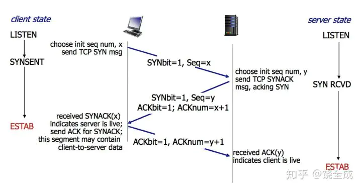
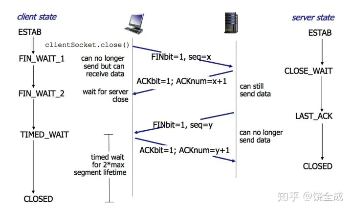

# TCP三次握手和四次挥手
**备注：(下文中提到的专业术语)**
```
ack —— 确认号码
seq —— 顺序号码
ISN —— 初始序列号
ACK —— 确认，使得确认号有效（握手使用）
SYN —— 用于初始化一个连接的序列号，建立联机
FIN —— 该报文的发送方已经结束向对方发送数据
```
## 一、TCP的三次握手

三次握手 实际就是Client端和Server端建立稳定TCP连接的发送三个包的过程。



* 第一次握手：(SYN=1, ACK=0, seq=x):
    > Client发送SYN标志位1的包到Server，以及初始序号x（保存在包头的序列号seq字段，简称ISN），和ACK标志位为0，并进入SYN_SEND状态，等待Server确认。
* 第二次握手：(SYN=1, ACK=1, seq=y, ack=x+1):
    > Server发回确认包(ACK)应答。即 SYN 标志位和 ACK 标志位均为1。Server确认ISN序列号，放到seq域里，同时将确认序号(ack)设置为Client的ISN加1，即x+1。 发送完毕后，Server进入 SYN_RCVD 状态。
* 第三次握手：(ACK=1，seq=x+1，ack=y+1)    
    > Client再次发送确认包(ACK)，ACK标志位为1，并且把Server发来ISN的序号字段+1，放在确定字段中发送给对方。                                                     
### 为什么要三次握手？
为什么要三次握手，我握两次不行吗？我觉得我说发，你说好，不就完了吗，非要矫情一下，握第三次手的意义是什么？

首先我们先来理解一下为什么需要握手？

客户端和服务器端通信前需要连接，而”握手“作用就是为了证明，***客户端的发送能力和服务器端的接受能力都是正常的***，这是”握手“来达到的目的。

* 第一次握手:客户端发送网络包，服务器端收到了，这样服务器端就能证明：客户端的发送能力、以及服务器端的接收能力都是正常的。           
* 第二次握手:服务端发包，客户端收到了。这样客户端就能得出结论：服务端的接收、发送能力，客户端的接收、发送能力是正常的。 从客户端的视角来看，我接到了服务端发送过来的响应数据包，说明服务端接收到了我在第一次握手时发送的网络包，并且成功发送了响应数据包，这就说明，服务端的接收、发送能力正常。而另一方面，我收到了服务端的响应数据包，说明我第一次发送的网络包成功到达服务端，这样，我自己的发送和接收能力也是正常的。
* 第三次握手：客户端发包，服务端收到了。这样服务端就能得出结论：客户端的接收、发送能力，服务端的发送、接收能力是正常的。 第一、二次握手后，服务端并不知道客户端的接收能力以及自己的发送能力是否正常。而在第三次握手时，服务端收到了客户端对第二次握手作的回应。从服务端的角度，我在第二次握手时的响应数据发送出去了，客户端接收到了。所以，我的发送能力是正常的。而客户端的接收能力也是正常的。

## TCP四次挥手

四次挥手，实际就是Client端和Server端关闭TCP连接的发送四个包的过程。
      
* 第一次挥手(FIN=1，seq=u)
    > Client 想要关闭连接，Client 会发送一个FIN标志位置为1，当前序列号为u的包，表示需要关闭连接了。Client进入 FIN_WAIT_1 状态。
* 第二次挥手(ACK=1，seq=v，ack=u+1)
    > Server收到Client的FIN包之后，会发送一个确认序号为收到的序列号u+1的包，表明自己接受到了Client关闭连接的请求，但还未准备好关闭连接。Server进入 CLOSE_WAIT 状态，Client进入 FIN_WAIT_2 状态。
* 第三次挥手(FIN=1，ACK=1，seq=w，ack=u+1)
    > 当Server将剩余数据发送完之后，会发送一个自己的FIN包，序列号为u+1。Server进入 LAST_ACK 状态，等待来自Client的最后一个ACK。
* 第四次挥手(ACK=1，seq=u+1，ack=w+1)
    > Client接收到来自Server端的关闭请求之后，发送最后一个ACK确认包，确认序号设置为收到序号加1。Client进入 TIME_WAIT状态，等待可能出现的要求重传的 ACK 包。Server接收到这个确认包之后，关闭连接，进入CLOSED状态。(Client会等待2MSL之后，没有收到Server的ACK ，就确认Server进入CLOSED状态，自己也关闭进入CLOSED状态。)

发送完毕后，Client和Server断开连接，TCP 挥手结束。

## 为什么建立连接是三次握手，而关闭连接却是四次挥手呢？

这是因为服务端在LISTEN（监听）状态下，收到建立连接请求的SYN报文后，把ACK和SYN放在一个报文里发送给客户端。而关闭连接时，当收到对方的FIN报文时，仅仅表示对方不再发送数据了但是还能接收数据，己方是否现在关闭发送数据通道，需要上层应用来决定，因此，己方ACK和FIN一般都会分开发送。
   
    


 