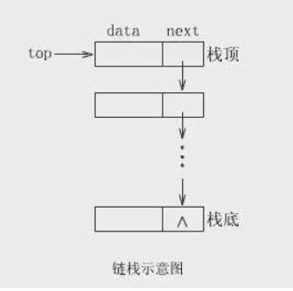
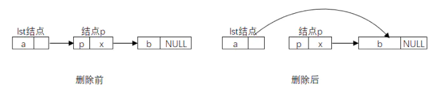
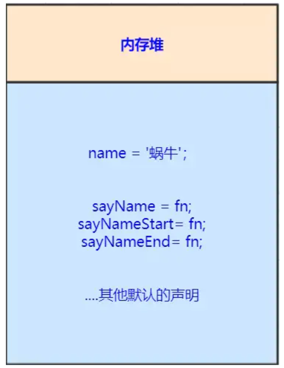
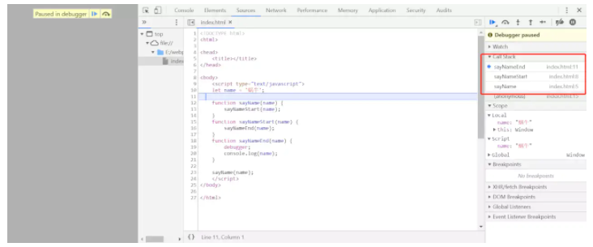

# 栈

栈是限定仅在表尾进行插入和删除操作的线性表，遵循 **后进先出（LIFO）** 原则。 我们把允许插入和删除的一端称为**栈顶**，另一端称为**栈底**，不含任何数据元素的栈称为空栈。
栈由编译器自动分配释放。栈使用一级缓存。调用时处于存储空间，调用完毕自动释放。

图示：


栈的插入操作，叫做**进栈**；栈的删除操作叫做**出栈**。

## 栈的存储结构（存储栈）

javaScript中，数据类型分为基本数据类型和引用数据类型，基本数据类型包含：string、number、boolean、undefined、null、symbol、bigint这几种。

在内存中这几种数据类型存储在栈空间。


### 栈的链式存储结构

把栈顶放在单链表的头部，用链表来存储栈的的数据结构称为链栈。

图示：



链栈的进栈就是头插法建立链表的插入操作；出栈就是单链表的删除操作。

链栈的插入操作:


链栈的删除操作:



## 执行栈（函数调用栈）

我们知道了基本数据结构的存储之后，我们再来看看JavaScript中如何通过栈来管理多个执行上下文。

* 程序执行进入一个执行环境时，它的执行上下文就会被创建，并被推入执行栈中(入栈)。
* 程序执行完成时，它的执行上下文就会被销毁，并从栈顶被推出(出栈)，控制权交由下一个执行上下文。

JavaScript中每一个可执行代码，在解释执行前，都会创建一个可执行上下文。按照可执行代码块可分为三种可执行上下文。

* 全局可执行上下文：每一个程序都有一个全局可执行代码，并且只有一个。任何不在函数内部的代码都在全局执行上下文。
* 函数可执行上下文：每当一个函数被调用时, 都会为该函数创建一个新的上下文。每个函数都被调用时都会创建它自己的执行上下文。
* Eval可执行上下文：Eval也有自己执行上下文。

因为JS执行中最先进入全局环境，所以处于"栈底的永远是全局环境的执行上下文"。而处于"栈顶的是当前正在执行函数的执行上下文"，当函数调用完成后，它就会从栈顶被推出（理想的情况下，闭包会阻止该操作）。

看个例子：

```javascript
    let name = '蜗牛';

function sayName(name) {
    sayNameStart(name);
}

function sayNameStart(name) {
    sayNameEnd(name);
}

function sayNameEnd(name) {
    console.log(name);
}
```

当代码进行**声明时**：



执行sayName函数时，会把直接函数压如执行栈，并且会创建执行上下文，执行完毕编译器会自动释放：



## 实践：创建一个栈

我们需要自己创建一个栈，并且这个栈包含一些方法。

* push(element(s)):添加一个（或多个）新元素到栈顶
* pop():删除栈顶的元素，并返回该元素
* peek():返回栈顶的元素，不对栈做任何操作
* isEmpty():检查栈是否为空
* size():返回栈的元素个数
* clear():清空栈

```javascript
let Stack = (function () {
    const items = new WeakMap();

    class Stack {
        constructor() {
            items.set(this, []);
        }

        getItems() {
            let s = items.get(this);
            return s;
        }

        push(element) {
            this.getItems().push(element);
        }

        pop() {
            return this.getItems().pop();
        }

        peek() {
            return this.getItems()[this.getItems.length - 1];
        }

        isEmpty() {
            return this.getItems().length == 0;
        }

        size() {
            return this.getItems().length;
        }

        clear() {
            this.getItems() = [];
        }
    }

    return Stack;
})();
```

# 堆

堆，一般由操作人员（程序员）分配释放，若操作人员不分配释放，将由OS回收释放。分配方式类似链表。堆存储在二级缓存中。

Object 类型都存储在堆内存中，是大小不定，复杂可变的。 Object 类型数据的 指针 存储在栈内存空间， 指针实际指向的值存储在堆内存空间。


# 为什么会有堆内存、栈内存之分

通常与垃圾回收机制有关。**为了使程序运行时占用的内存最小。**

当一个方法执行时，每个方法都会建立自己的内存栈，在这个方法内定义的变量将会逐个放入这块栈内存里，随着方法的执行结束，这个方法的内存栈也将自然销毁了。因此，所有在方法中定义的变量都是放在栈内存中的；

当我们在程序中创建一个对象时，这个对象将被保存到运行时数据区中，以便反复利用（因为对象的创建成本通常较大），这个运行时数据区就是堆内存。堆内存中的对象不会随方法的结束而销毁，即使方法结束后，这个对象还可能被另一个引用变量所引用（方法的参数传递时很常见），则这个对象依然不会被销毁，只有当一个对象没有任何引用变量引用它时，系统的垃圾回收机制才会在核实的时候回收它。

# 队列

队列是只允许在一端进行插入操作，而在另一端进行删除操作的线性表，队列是一种**先进先出**的线性表，简称FIFO.

在现实中最常见的队列就是排队，先排队的先服务。


## 创建一个队列

实现包含以下方法的Queue类

* enqueue(element(s)):向队列尾部添加一个（或多个）元素。
* dequeue():移除队列的第一项，并返回移除的元素。
* front():返回队列的第一个元素--最先被添加，最先被移除的元素。
* isEmpty():判断队列是否为空。
* size():返回队列的长度。

```javascript
let Queue1 = (function () {
    const items = new WeakMap();

    class Queue1 {
        constructor() {
            items.set(this, []);
        }

        // 获取队列
        getQueue() {
            return items.get(this);
        }

        // 添加元素
        enqueue(element) {
            this.getQueue().push(element);
        }

        // 删除元素
        dequeue() {
            return this.getQueue().shift();
        }

        // 返回队列第一个元素
        front() {
            return this.getQueue()[0];
        }

        // 判断队列是否为空
        isEmpty() {
            return this.getQueue().length === 0;
        }

        // 返回队列长度
        size() {
            return this.getQueue().length;
        }
    }

    return Queue1;
})();
```

# 实践

## 有效括号

给定一个只包括 '('，')'，'{'，'}'，'['，']' 的字符串，判断字符串是否有效。

有效字符串需满足：

左括号必须用相同类型的右括号闭合。 左括号必须以正确的顺序闭合。 注意空字符串可被认为是有效字符串。

示例:

```javascript
输入: "()"
输出: true
```

代码实现

```javascript
var isValid = function (s) {
    let stack = [];
    for (let i = 0; i < s.length; i++) {
        let ch = s.charAt(i);
        if (ch == '(' || ch == '[' || ch == '{')
            stack.push(ch);
        if (!stack.length) return false;
        if (ch == ')' && stack.pop() !== '(') return false;
        if (ch == ']' && stack.pop() !== '[') return false;
        if (ch == '}' && stack.pop() !== '{') return false;
    }
    return stack.length === 0;
};
```

## 多维数组 flatten

将多维数组转化为一维数组。

示例：

```javascript
[1, [2, [3, [4, 5]]], 6]
->
[1, 2, 3, 4, 5, 6]
```

代码实现:
```javascript
let flatten = (nestedList) => {
    let result = [];
    let fn = function (target, ary) {
        for (let i = 0; i < ary.length; i++) {
            let item = ary[i];
            if (Array.isArray(ary[i])) {
                fn(target, item);
            } else {
                target.push(item);
            }
        }
    }
    fn(result, nestedList)
    return result;
```
