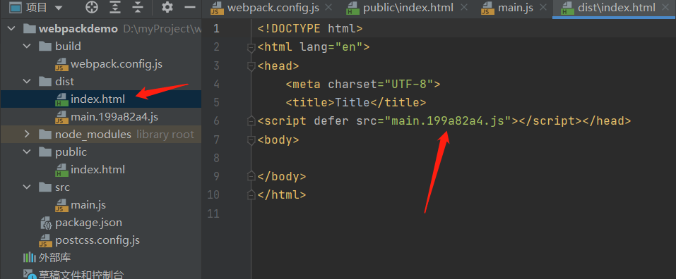
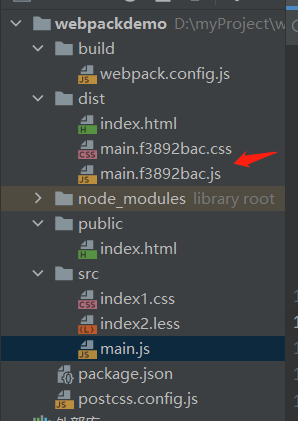
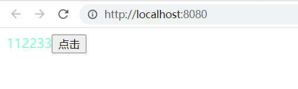

<!-- toc -->

# 一、初始化项目

## 1. 新建webpackdemo目录，初始化npm

```
npm init
```

## 2. 安装webpack包

```
npm i -D webpack webpack-cli webpack-dev-server
```

## 3. 创建配置webpack.config.js和入口main.js

首先新建src目录，并在下面新建一个main.js

之后新建build文件夹并新建webpack.config.js添加如下配置：

```javascript
const path = require('path');
module.exports = {
    mode: 'development', // 开发模式
    entry: path.resolve(__dirname, '../src/main.js'), // 入口文件
    output: {
        filename: '[name].[hash:8].js', // [name] 指entry属性名字, 默认为main
        path: path.resolve(__dirname, '../dist'), // 打包后的目录
        clean: true, // 打包前清空输出目录，相当于clean-webpack-plugin插件的作用,webpack5新增。
    }
}
```

## 4. 安装插件html-webpack-plugin

文件打包好之后,我们不可能每次在html文件中手动引入打包好的js，这时候就需要使用html-webpack-plugin创建html页面，并将打包后的js文件需要引入到html中

```
npm i -D html-webpack-plugin
```

我们来测试一下，新建public文件夹，新建index.html文件，更改webpack.config.js配置：

```javascript
const HtmlWebpackPlugin = require('html-webpack-plugin')

module.exports = {
    plugins: [
        new HtmlWebpackPlugin({
            // 选取一个html作为模版，在dist目录下会生成一个相同的html，之后将打包好的js注入到该html文件
            template: path.resolve(__dirname, '../public/index.html')
        })
    ]
}
```

同时在package.json中添加一行打包命令：

```
"build": "webpack --config build/webpack.config.js"
```

运行```npm run build```，可以看到生成了dist文件夹并在index.html引入了js



## 5.引用css

在引入css时也需要一些loader来解析我们的css：

```
npm i -D style-loader css-loader less less-loader
```

配置文件如下：

```javascript
// webpack.config.js

module.exports = {
    //...省略其他配置
    module: {
        rules: [
            {
                // 用正则去匹配要用该 loader 转换的 CSS 文件
                test: /\.css$/,
                exclude: path.resolve(__dirname, 'node_modules'),
                use: ['style-loader', 'css-loader'] // 切记从右向左解析原则
            },
            {
                test: /.less$/,
                exclude: path.resolve(__dirname, 'node_modules'),
                use: ['style-loader', 'css-loader', 'less-loader'] // 从右向左解析原则   
            }
        ]
    }
}
```

## 6.为css添加浏览器前缀

安装插件：

```
npm i -D postcss-loader autoprefixer 
```

引入autoprefixer有两种方式：

(1) 在项目根目录下创建一个postcss.config.js文件，配置如下：

```javascript
module.exports = {
    plugins: [require('autoprefixer')]  // 引用该插件即可了
}
```

(2) 直接在webpack.config.js里配置:

```javascript
// webpack.config.js
module.exports = {
    //...省略其他配置
    module: {
        rules: [{
            test: /\.less$/,
            use: ['style-loader', 'css-loader', {
                loader: 'postcss-loader',
                options: {
                    plugins: [require('autoprefixer')]
                }
            }, 'less-loader'] // 从右向左解析原则
        }]
    }
}
```

这里我们使用第一种方式，之后在webpack.config.js里配置postcss-loader：

```javascript
// webpack.config.js

module.exports = {
//...省略其他配置
    module: {
        rules: [
            {
                // 用正则去匹配要用该 loader 转换的 CSS 文件
                test: /\.css$/,
                exclude: path.resolve(__dirname, 'node_modules'),
                use: ['style-loader', 'css-loader', 'postcss-loader'] // 切记从右向左解析原则
            },
            {
                test: /.less$/,
                exclude: path.resolve(__dirname, 'node_modules'),
                use: ['style-loader', 'css-loader', 'postcss-loader', 'less-loader'] // 从右向左解析原则   
            }
        ]
    }
}
```

## 7.把css样式从js文件中提取到单独的css文件中

安装插件：

```
npm i -D mini-css-extract-plugin
```

配置：

```javascript
const MiniCssExtractPlugin = require('mini-css-extract-plugin')
module.exports = {
    //...省略其他配置
    module: {
        rules: [
            {
                // 用正则去匹配要用该 loader 转换的 CSS 文件
                test: /\.css$/,
                exclude: path.resolve(__dirname, 'node_modules'),
                use: [MiniCssExtractPlugin.loader, 'css-loader', 'postcss-loader'] // 切记从右向左解析原则
            },
            {
                test: /.less$/,
                exclude: path.resolve(__dirname, 'node_modules'),
                use: [MiniCssExtractPlugin.loader, 'css-loader', 'postcss-loader', 'less-loader'],
            }
        ]
    },
    plugins: [
        new MiniCssExtractPlugin({
            filename: "[name].[hash:8].css",
            chunkFilename: "[id].css",
        })
    ]
}
```

测试一下，在src下面新建一个index1.css文件和index2.less文件，并在main.js引入。

之后运行下```npm run build``，可以看到dist下的js和css。发现main.css整合了src下面两个css



## 8. babel转义js文件

安装插件：

```
npm i -D babel-loader @babel/preset-env @babel/core @babel/plugin-proposal-decorators

npm i -D @babel/plugin-transform-arrow-functions @babel/plugin-transform-runtime
```

babel-loader负责将ES6/7/8等语法转换为ES5语法 core-js负责将新的api进行转化，例如promise、Generator、Set、Maps、Proxy等

webpack.config.js配置：

```javascript
rules: [
    {
        test: /\.m?js$/,
        exclude: /node_modules/,
        use: {
            loader: 'babel-loader',
            options: {
                // 缓存，加快babel-loader编译速度
                cacheDirectory: true,
                // 一系列插件的集合，包括处理箭头函数等
                // useBuiltIns corejs 解决es6新增api无法编译问题（只能编译语法，例如箭头函数）
                presets: [
                    ['@babel/preset-env', {useBuiltIns: 'usage', corejs: 3, targets: 'defaults'}]
                ],
                plugins: [
                    // 编译箭头函数
                    '@babel/plugin-transform-arrow-functions',
                    // 编译装饰器
                    ['@babel/plugin-proposal-decorators', {legacy: true}],
                    // 编译类，loose true时是赋值法定义属性，false时是使用Object.defineProperty定义属性，后者是默认
                    ['@babel/plugin-proposal-class-properties', {loose: false}]
                ]
            }
        }
    }
]
```

## 9. 图片、音频、字体文件处理

在webpack5以前，需要安装file-loader和url-loader处理，但是webpack内置了资源模块（asset module），代替了file-loader和url-loader，所以只需要这样做即可：

```javascript
            {
                test:/\.svg$/,
                type:'asset',
                generator:{
                    filename:"icons/[name]--[hash:8].[ext]"
                }
            },
            {
                test:/\.(png|jpe?g|gif)(\?.*)?$/,
                type:'asset',
                generator: {
                    filename: 'imgs/[name]--[hash:8].[ext]'
                }
            },
            {
                test: /\.(mp4|webm|ogg|mp3|wav|flac|aac)(\?.*)?$/,
                type: 'asset',
                generator: {
                    filename: 'media/[name]--[hash:8].[ext]'
                }
            },
            {
                test: /\.(woff2?|eot|ttf|otf)(\?.*)?$/,
                type: 'asset',
                generator: {
                    filename: 'fonts/[name]--[hash:8].[ext]'
                }
            }
```
## 10.完整配置代码

<details>
  <summary>**完整代码**</summary>

```javascript
const path = require('path');
const HtmlWebpackPlugin = require('html-webpack-plugin');
const MiniCssExtractPlugin = require('mini-css-extract-plugin');

module.exports = {
    mode: 'development', // 开发模式
    entry: path.resolve(__dirname, '../src/main.js'), // 入口文件
    output: {
        filename: '[name].[hash:8].js', // [name] 指entry属性名字, 默认为main
        path: path.resolve(__dirname, '../dist'), // 打包后的目录
        clean: true, // 打包前清空输出目录，相当于clean-webpack-plugin插件的作用,webpack5新增。
    },
    plugins: [
        new HtmlWebpackPlugin({
            // 选取一个html作为模版，在dist目录下会生成一个相同的html，之后将打包好的js注入到该html文件
            template: path.resolve(__dirname, '../public/index.html')
        }),
        new MiniCssExtractPlugin({
            filename: "[name].[hash:8].css",
            chunkFilename: "[id].css",
        })
    ],
    module: {
        rules: [
            {
                // 用正则去匹配要用该 loader 转换的 CSS 文件
                test: /\.css$/,
                exclude: path.resolve(__dirname, 'node_modules'),
                use: [MiniCssExtractPlugin.loader, 'css-loader', 'postcss-loader'] // 切记从右向左解析原则
            },
            {
                test: /.less$/,
                exclude: path.resolve(__dirname, 'node_modules'),
                use: [MiniCssExtractPlugin.loader, 'css-loader', 'postcss-loader', 'less-loader'],
            },
            {
                test:/\.svg$/,
                type:'asset',
                generator:{
                    filename:"icons/[name]--[hash:8].[ext]"
                }
            },
            {
                test:/\.(png|jpe?g|gif)(\?.*)?$/,
                type:'asset',
                generator: {
                    filename: 'imgs/[name]--[hash:8].[ext]'
                }
            },
            {
                test: /\.(mp4|webm|ogg|mp3|wav|flac|aac)(\?.*)?$/,
                type: 'asset',
                generator: {
                    filename: 'media/[name]--[hash:8].[ext]'
                }
            },
            {
                test: /\.(woff2?|eot|ttf|otf)(\?.*)?$/,
                type: 'asset',
                generator: {
                    filename: 'fonts/[name]--[hash:8].[ext]'
                }
            },
            {
                test: /\.m?js$/,
                exclude: /node_modules/,
                use: {
                    loader: 'babel-loader',
                    options: {
                        // 缓存，加快babel-loader编译速度
                        cacheDirectory: true,
                        // 一系列插件的集合，包括处理箭头函数等，配置后是否需要配置plugins? 后面再看
                        // 2021/5/12 结论：不需要配置其他plugins
                        // useBuiltIns corejs 解决es6新增api无法编译问题（只能编译语法，例如箭头函数）
                        presets: [
                            // ['@babel/preset-env', { targets: 'defaults' }]
                            ['@babel/preset-env', {useBuiltIns: 'usage', corejs: 3, targets: 'defaults'}]
                        ],
                        plugins: [
                            // 编译箭头函数
                            '@babel/plugin-transform-arrow-functions',
                            // 编译装饰器
                            ['@babel/plugin-proposal-decorators', {legacy: true}],
                            // 编译类，loose true时是赋值法定义属性，false时是使用Object.defineProperty定义属性，后者是默认
                            ['@babel/plugin-proposal-class-properties', {loose: false}]
                        ]
                    }
                }
            }
        ]
    }
};
```
</details>


# 二、区分开发环境和生产环境


## 1.热更新配置

安装 webpack-dev-server 启动一个本地服务并且配置热更新：

```
npm i -D webpack-dev-server
```

配置如下：

```javascript
module.exports = {
    // ...
    devServer: {
        port: 3000,
        // 根据需要是否开启以下配置
        // hot: true, //热更新
        // open: true, //编译完自动打开浏览器
        // compress: true,//开启gzip压缩
        // static: { //托管静态资源文件
        //     directory: path.join(__dirname, "../public"),
        // },
        // client: { //在浏览器端打印编译进度
        //     progress: true,
        // },
    }
}
```

之后去配置打包命令：

```
"dev": "webpack serve --config build/webpack.config.js"
```

## 2.区分开发环境与生产环境的关系。

新建两个文件夹

* webpack.dev.js 开发环境使用
* webpack.prod.js 生产环境使用
* webpack.config.js 公用配置

使用webpack-merge帮我们merge代码：

```
npm i -D webpack-merge
```

```javascript
// webpack.dev.js
const { merge } = require('webpack-merge');
const common = require('./webpack.config.js')

module.exports = merge(common, {
  mode: 'development',
  devServer:{
    port:3000
  }
});
```

```javascript
// webpack.prod.js
const { merge } = require('webpack-merge');
const common = require('./webpack.config.js');

module.exports = merge(common, {
  mode: 'production',
});
```

原先的webpack.config.js也需要做出修改，我们只需要删除mode和devserver字段就行了

最后package.json中的scripts命令如下：

```
"scripts": {
    "build": "webpack --config build/webpack.prod.js",
    "dev": "webpack serve --config build/webpack.dev.js"
  },
```
开发环境运行npm run dev,打包npm run build

## 3.定义环境变量

首先安装cross-env插件，是一个运行跨平台设置和使用环境变量的脚本

```
npm i cross-env -D
```

之后更改打包命令：

```javascript
"scripts": {
    "dev": "cross-env NODE_ENV=development webpack serve --config build/webpack.dev.js",
    "build": "cross-env NODE_ENV=production webpack --config build/webpack.prod.js",
    "test": "echo \"Error: no test specified\" && exit 1"
  }
```

新建config文件夹，新建dev.env.js：

```javascript
module.exports = {
    NODE_ENV: '"development"',
    url: '"http://xxxxxx"'
};
```

修改webpck.dev.js：

```javascript
const env = require("../config/dev.env");
const webpack =require("webpack")

module.exports = merge(common,{
  plugins: [
    new webpack.DefinePlugin({
      "process.env": env,
    }),
  ],
})
```

在main.js打印console.log(process.env)

prod同理。

# 三、持续优化

上面进行了基础的配置，接下来我们对项目进行持续优化，比如按需加载、压缩项目体积等等...

## 1.打包文件分析工具webpack-bundle-analyzer

这个插件的功能是生成代码分析报告，帮助提升代码质量和网站性能。

```
// 安装
npm i webpack-bundle-analyzer -D

// 配置
//webpack.prod.js

const BundleAnalyzerPlugin = require('webpack-bundle-analyzer').BundleAnalyzerPlugin; 

plugins:[
    new BundleAnalyzerPlugin()
]
```

运行 npm run build ，编译结束新开一个页面，可以看到bundle之间的关系

## 2.通过splitChunks分离chunks

splitChunks是webpack内置的，无需安装插件，可以根据需要进行配置。

作用：拆分chunk。

文档地址：<https://webpack.docschina.org/plugins/split-chunks-plugin/>

默认配置：
```javascript
// webpack.prod.js
module.exports = {
  //...
  optimization: {
    splitChunks: {
      chunks: 'async',
      minSize: 20000,
      minRemainingSize: 0,
      minChunks: 1,
      maxAsyncRequests: 30,
      maxInitialRequests: 30,
      enforceSizeThreshold: 50000,
      cacheGroups: {
        defaultVendors: {
          test: /[\\/]node_modules[\\/]/,
          priority: -10,
          reuseExistingChunk: true,
        },
        default: {
          minChunks: 2,
          priority: -20,
          reuseExistingChunk: true,
        },
      },
    },
  },
}
```
## 3.开启gzip压缩-compression-webpack-plugin

安装插件：
```
npm i compression-webpack-plugin -D
```
配置：
```javascript
//webpack.prod.js
const CompressionPlugin = require("compression-webpack-plugin");

module.exports = {
  plugins: [new CompressionPlugin()],
};
```
## 4.优化和压缩CSS-css-minimizer-webpack-plugin

安装插件：

```
npm i css-minimizer-webpack-plugin --save-dev
```

配置：

```javascript
//webpack.prod.js
const CssMinimizerPlugin = require('css-minimizer-webpack-plugin');

plugins:[
    new CssMinimizerPlugin(),
]
```

# 四、搭建Vue开发环境

## 1.安装必要依赖

```
npm i -D vue-loader vue-template-compiler vue-style-loader
npm i -S vue
```

> * vue-loader 用于解析.vue文件
> * vue-template-compiler 用于编译模板
> * vue-style-loader 解析样式

配置webpack.config.js：
```javascript
const vueLoaderPlugin = require('vue-loader/lib/plugin')
module.exports = {
  // ...
  module:{
    rules:[
      // 这一个loader必须放在最前面
      {
        test:/\.vue$/,
        use:['vue-loader']
      }
      // ...
    ]
  },
  resolve:{
    // 设置路径别名
    alias:{
      'vue$':'vue/dist/vue.runtime.esm.js',
      '@':path.resolve(__dirname,'../src')
    },
    // 尝试按顺序解析这些后缀名。
    // 如果有多个文件有相同的名字，但后缀名不同，webpack 会解析列在数组首位的后缀的文件 并跳过其余的后缀。
    extensions:['*','.js','.json','.vue']
  },
  plugins:[
    new vueLoaderPlugin()
  ]
}
```


## 3.创建一个vue文件

修改原来的main.js：

```javascript
// main.js
import Vue from 'vue'
import App from './App.vue'

new Vue({
  render: h => h(App)
}).$mount('#app')
```

新建一个App.vue文件:

```vue
<template>
  <div class="content">
    {{ msg }}
    <button @click="msgChange">点击</button>
  </div>
</template>

<script>
export default {
  data() {
    return {
      msg: "hello world"
    };
  },
  methods: {
    msgChange() {
      this.msg = "112233";
    }
  }
};
</script>

<style scoped>
.content {
  color: aquamarine;
  display: flex;
}
</style>
```

修改原来的index.html:

```html
<!DOCTYPE html>
<html lang="en">
<head>
    <meta charset="UTF-8">
    <title>Title</title>
</head>
<body>
<div id="app"></div>
</body>
</html>
```

最后运行```npm run dev```,查看效果：




# 代码地址

以上demo上传到了github，地址：<https://github.com/zhenyuyyk/webpackdemo>
