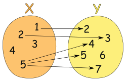

# 什么是函数式编程
函数式编程(Functional Programming,FP)，FP是编程的一种范式，我们常见的编程范式还有面向对象、面向过程。

* 面向对象编程：就是把现实世界中的事物抽象成编程世界中的类和对象，通过封装、集成和多态来演示事物事件中间的联系
* 函数式编程：就是把现实世界中的事物和事物之间的联系抽象到程序世界(对运算过程进行抽象)。这里的“函数”不是指计算机中的函数，而是指数学中的函数，即自变量的映射。

数学函数：
> 一般的，在一个变化过程中，假设有两个变量 x、y，如果对于任意一个 x 都有唯一确定的一个y和它对应，那么就称 x 是自变量，y 是 x 的函数。x 的取值范围叫做这个函数的定义域，相应 y 的取值范围叫做函数的值域。

换句话说，函数只是两种数值之间的关系：输入和输出。

尽管每个输入都只会有一个输出，但不同的输入却可以有相同的输出。下图展示了一个合法的从 x 到 y 的函数关系；


与之相反，下面这张图表展示的就不是一种函数关系，因为输入值 5 指向了多个输出：

  

# 纯函数（Pure Functions）

> 纯函数是这样一种函数，对于相同的输入，永远会得到相同的输出，而且没有任何可观察的副作用。

## 1、纯函数相同的输入，永远会得到相同的输出

用splice和slice来解释一下:

```
var xs = [1,2,3,4,5];

// 纯的
xs.slice(0,3);
//=> [1,2,3]

xs.slice(0,3);
//=> [1,2,3]

xs.slice(0,3);
//=> [1,2,3]


// 不纯的
xs.splice(0,3);
//=> [1,2,3]

xs.splice(0,3);
//=> [4,5]

xs.splice(0,3);
//=> []
```

<font color=red>slice</font>收到同样的参数，每次返回相同的值，所以是纯函数

<font color=red>splice</font>收到同样的参数，每次返回不同的值，所以不是纯函数

## 2、纯函数不会受到外部环境的影响

```
const z = 10;
add(x, y) {
    return x + y;
}
```

add函数就是一个纯函数，它读取x和y两个参数的值，返回它们的和，并且不会受到全局的z变量的影响

把这个函数改一下

```
const z = 10;
add(x, y) {
    return x + y + z;
}
```

这个函数就变成了不纯的函数了，因为它返回的值会受到全局的z的影响

函数式编程具有两个最基本的运算：合成（compose）和柯里化（Currying）。

# 函数合成（compose）

函数合成指的是将代表各个动作的多个函数合并成一个函数。

打个比方：我要计算一个数 加上 4 再乘以 4 的值，可以这样做
```
function add4(x) {
    return x + 4
}
function multiply4(x) {
    return x * 4
}

console.log(multiply4(add4(1)))  // 20
```
根据函数合成的定义，我们将合成的动作抽象为一个函数 compose，函数 compose 的代码如下
```
function compose(f,g) {
    return function(x) {
        return f(g(x));
    };
}
```
所以我们可以通过如下的方式得到合成函数
```
var calculate=compose(multiply4,add4);  //执行动作的顺序是从右往左

console.log(calculate(1))  // 20
```

可以看到，只要往 compose 函数中传入代表各个动作的函数，我们便能得到最终的合成函数。但上述 compose 函数的局限性是只能够合成两个函数，如果需要合成的函数不止两个呢，所以我们需要一个通用的 compose 函数。

这里我直接给出通用 compose 函数的代码
```
function compose() {
  var args = arguments;
  var start = args.length - 1;
  return function () {
    var i = start - 1;
    var result = args[start].apply(this, arguments);
    while (i >= 0){
      result = args[i].call(this, result);
      i--;
    }
    return result;
  };
}
```
# 函数柯里化（Currying）

在维基百科中对柯里化的定义是：在计算机科学中，柯里化，又译为卡瑞化或加里化，是把接受多个参数的函数变换成接受一个单一参数（最初函数的第一个参数）的函数，并且返回接受余下的参数而且返回结果的新函数的技术。

柯里化函数则是将函数柯里化之后得到的一个新函数。由上述定义可知，柯里化函数有如下两个特性：
* 接受一个单一参数
* 返回接受余下的参数而且返回结果的新函数

比如，我们将以下函数柯里化：
```
function add(a, b) {
    return a + b;
}

console.log(add(1, 2)) // 3
```
假设函数 add 的柯里化函数是 addCurry，那么从上述定义可知，addCurry(1)(2) 应该实现与上述代码相同的效果，输出 3 。这里我们可以比较容易的知道，addCurry 的代码如下
```
// addCurry 是 add 的柯里化函数
function addCurry(a) {
    return function(b) {
        return a + b;
    }
}

console.log(addCurry(1)(2));  // 3
```
上面的柯里化函数只能处理add函数，加入有一个共用的 createCurry 能够实现柯里化，那么我们便可以通过下述的方式来得出相同的结果
```
// createCurry 返回一个柯里化函数
var addCurry=createCurry(add);

console.log(addCurry(1)(2));  // 3
```
那么，怎么得到实现柯里化的函数 createCurry 呢？这里我直接给出 createCurry 的代码
```
// 参数只能从左到右传递
function createCurry(func, arrArgs) {
    var args=arguments;
    var funcLength = func.length;
    var arrArgs = arrArgs || [];

    return function() {
        var _arrArgs = Array.prototype.slice.call(arguments);
        var allArrArgs=arrArgs.concat(_arrArgs)

        // 如果参数个数小于最初的func.length，则递归调用，继续收集参数
        if (allArrArgs.length < funcLength) {
            return args.callee.call(this, func, allArrArgs);
        }

        // 参数收集完毕，则执行func
        return func.apply(this, allArrArgs);
    }
}
```
我们可以这样使用：
```
// createCurry 返回一个柯里化函数
var addCurry=createCurry(function(a, b, c) {
    return a + b + c;
});

console.log(addCurry(1)(2)(3));  // 6
console.log(addCurry(1, 2, 3));  // 6
console.log(addCurry(1, 2)(3));  // 6
console.log(addCurry(1)(2, 3));  // 6
```
那么，柯里化有什么用途呢？举个例子～

现在我们需要实现一个功能，将一个全是数字的数组中的数字转换成百分数的形式。按照正常的逻辑，我们可以按如下代码实现
```
function getNewArray(array) {
    return array.map(function(item) {
        return item * 100 + '%'
    })
}

console.log(getNewArray([1, 0.2, 3, 0.4]));   // ['100%', '20%', '300%', '40%']
```
而如果通过柯里化的方式来实现
```
function map(func, array) {
    return array.map(func);
}
var mapCurry = createCurry(map);
var getNewArray = mapCurry(function(item) {
    return item * 100 + '%'
})

console.log(getNewArray([1, 0.2, 3, 0.4]));   // ['100%', '20%', '300%', '40%']
```

# 高阶函数 (Higher order function)
如果一个函数接受函数作为参数，或者返回值为函数，那么该函数就是高阶函数。

一个简单的高阶函数：
```
//一个简单的高阶函数
function add(x,y,f){
    return f(x)+f(y);
}
var x=add(-5,6,Math.abs);  //-> 11
```
数组中常用到的高阶函数
```
 Array.prototype.map()
 Array.prototype.reduce()
 Array.prototype.filter()
 Array.prototype.sort()
 Array.prototype.find()
```
试着创建一个高阶函数：

假设有一个字符串数组，希望将此数组转换为整数数组，其中每个元素表示原始数组中字符串的长度。

```
function mapForEach(arr, fn) {
  const newArray = [];
  for(let i = 0; i < arr.length; i++) {
    newArray.push(
      fn(arr[i])
    );
  }
  return newArray;
}
const lenArray = mapForEach(strArray, function(item) {
  return item.length;
});
// prints [ 10, 6, 3, 4, 1 ]
console.log(lenArray);
```

# 函子（Functor）

## 为什么需要函子？
函数式编程的函数指的就是纯函数，纯函数是没有可观察的副作用。但是副作用是不可避免的，我们只能将副作用控制在可控范围内。函子就是用来控制副作用的容器，除了这些以外，我们还可以通过函子来控制异常和异步操作。

## 什么是函子？
* 是一个对象
* 遵守一些特定规则的容器类型，通过一个普通的对象实现，该对象具有map方法，map方法可以运行一个函数对值进行处理(变形关系)

```
// 函数式编程一般约定，函子有一个of方法，用来生成新的容器
class Container {
    // 此处我们使用static来创建一个静态方法
    static of(value) {
        return new Container(value)
    }
    
    constructor(value) {
        this._value = value
    }
    
    map(fn) {
        // 那此处我们也可以直接使用of
        return Container.of(fn(this._value))
    }
}
// 使用示例
const r = Container.of(5)
            .map(v => v + 2)
            .map(v => v * v)
console.log(r) // => Container { _value: 49 }
// 通过以上方式我们实现了更函数式编程的函子
// 上面我们得到了一个r函子对象，而不是一个值，那我们怎么拿出这个值呢？
// 其实我们永远不去拿出这个值，它是一直存储在函子对象中的
```
总结：

* 函数式编程的运算不直接操作值，而是由函子完成
* 函子就是一个实现了map契约(方法)的对象
* 我们可以吧函子想象成一个函子，这个盒子里封装了一个值
* 想要处理盒子中的值，我们需要给盒子的map方法传递一个处理函数(纯函数)，由这个函数来对值进行处理
* 最终map方法返回一个包含新值的盒子(函子)

## 常用的几个函子
### Maybe函子
函子接受各种函数来处理内部容器的值，那么我们就会遇到这样一个问题：容器内部的值可能是一个空值(null/undefined)，而外部函数可能未做空值的处理，这时候就可能报错。

使用Maybe函子处理空值情况
```
    class Maybe {
        static of(value) {
            return new Maybe(value)
        }
    
        constructor(value) {
            this._value = value
        }
        
        map(fn) {
            // 使用传递的函数处理内部值时判断下
            return this.valid() ? Maybe.of(fn(this._value)) : Maybe.of(null)
        }
        
        // 创建辅助函数来判断空值
        valid() {
            return this._value != null || this._value != undefined
        }
    }
    
    // 测试：不是空值时
    const r = Maybe.of('Hello World')
        .map(x => x.toUpperCase())
        console.log(r) // => Maybe { _value: 'HELLO WORLD' }
    
    // 测试：是空值时
    const r = Maybe.of(null)
        .map(x => x.toUpperCase())
        console.log(r) // => Maybe { _value: null } 
```
### Either函子
在Maybe函子中我们学习了如何处理函子内部值是空值的情况，此时我们可以控制传入值的异常。那如果我们在调用传入处理函数fn时返回空值时也会出现异常，那我们应该如何处理呢。

Either函子

* Either：两者中的任何一个，类似if...else...的处理
* 异常会让函数变得不纯，Either函子可以用来处理异常
```
    // Either函子：二选一
    // 因为是二选一，我们来定义两个函子
    class Left {
        static of(value) {
            return new Left(value)
        }
        
        constructor(value) {
            this._value = value
        }
        
        map(fn) {
            // 此处有所不同
            // 直接返回当前对象
            return this
        }
    }
    
    class Right {
        static of(value) {
            return new Right(value)
        }
        
        constructor(value) {
            this._value = value
        }
        
        map(fn) {
            return Right.of(fn(this._value))
        }
    }
    
    //创建两个函子看一下不同之处
    const l = Left.of(12).map(v => v + 2)
    const r = Right.of(12).map(v => v + 2)
    console.log(l) // => Left { _value: 12 }
    console.log(r) // => Right { _value: 14 }
    
    // 分析：两处结果不同的原因
    // Right函子中map我们是做了正常函子做的事情，得到的结果是预期的
    // Left函子中map我们是直接将当前对象返回，并没有做任何处理，其内部值不会改变
    
    // Left函子有什么作用？
    // 对于纯函数来说，相同的输入要有相同的输出，当发生异常时函子也应该给出相同的输出
    // 因此我们可以使用Left函子来处理异常
    
    // 使用示例：将字符串转成json，在转换时可能发生异常
    function parseJSON(str) {
        try {
            // 当没有异常时正常处理
            return Right.of(JSON.parse(str))
        } catch(e) {
            // 当出现异常时，我们使用Left函子来保存异常
            return Left.of({ error: e.message })
        }
    }
    // 使用
    // 出现异常的
    const errorP = parseJSON('{ name: rh }')
    console.log(errorP) // => Left { _value: { error: 'Unexpected token n in JSON at position 2' } }
    const p = parseJSON('{ "name": "rh" }')
    console.log(p) // => Right { _value: { name: 'rh' } }
    // 通过输出我们可以看到当出现异常时我们能通过Left函子来处理并存储异常
    // 当没有异常时Right函子可以正常执行
```
### IO函子
* IO函子中的_value是一个函数，这里是把函数作为值来处理
* IO函子可以把不纯的动作存储到_value中，延迟这个不纯的操作(惰性执行)，包装当前的操作
* 把不纯的操作交给调用者来处理
```
    const fp = require('lodash/fp')
    
    class IO {
        // of函数传入的还是一个值
        static of(value) {
            // 此时我们使用IO函子的构造函数
            return new IO(function() {
                // 此时我们通过函数将传递进来的值返回
                return value
            })
        }
        // 此时构造函数里边传入的是一个函数
        constructor(fn) {
            this._value = fn
        }
        
        map(fn) {
            // 返回IO，但是此时我们使用的是IO的构造函数
            // 此时我们使用fp模块中的flowRight将IO函子中存储的value(函数)和map传入的fn进行组合
            return new IO(fp.flowRight(fn, this._value))
        }
    }
    
    // 使用
    // 当前我们使用的是node环境，我们将node中的对象传递进来
    // 当调用IO的of函数时of函数会将我们传递进来值保存到一个函数中，在使用时再来获取process
    // 然后使用map来获取属性
    const io = IO.of(process).map(v => v.execPath)
    console.log(io) // => IO { _value: [Function] }
    // 通过log我们可以看到我们得到了一个io函子，函子中保存的是一个函数
    // value中的function是谁呢？我们来看一下合成过程
    // 1. of方法返回的是io对象，这个io对象中的value存储了一个函数，这个函数返回当前传入的process
    // 2. map方法返回了一个新的io函子，这个新的io函子中value保存的是经过组合的函数
    // 3. map方法中组合了fn和this._value,fn是我们传入的v => v.execPath,this._value是我们使用of得到创建的IO对象中保存的函数(即返回value那个)
    // 4. 那么我们log中得到的function就是分析3中那俩函数的组合
    
    // 获取io对象中的函数
    const ioFn = io._value
    console.log(ioFn()) // => /usr/local/Cellar/node/12.6.0/bin/node (node的执行路径)

```
